# TechJam 2026 — Conversational Shopping Copilot

> **Problem Statement 4: Shopping Copilot — AI Conversational Search and Recommendations**

A multi-turn shopping agent that combines **field-aware lexical search, lightweight local semantic retrieval, conversational state, hard-constraint handling, adaptive clarification, and safe personalization** to find a shopper's hidden target product as early and as highly ranked as possible.

The system searches a frozen catalogue of **50,000 Amazon Reviews 2023 Clothing, Shoes & Jewelry products** and must recommend the correct `parent_asin` within at most **10 turns**.

---

## At a Glance

| Item                             | Final System                                      |
| -------------------------------- | ------------------------------------------------- |
| Catalogue                        | 50,000 frozen products                            |
| Public development sessions      | 200                                               |
| Private evaluation sessions      | 800                                               |
| Primary retrieval                | Field-aware BM25                                  |
| Semantic retrieval               | Local TF-IDF + TruncatedSVD (LSA)                 |
| Ranking                          | Deterministic constraint-aware reranking          |
| Conversation                     | Stateful, multi-turn                              |
| Intent handling                  | Buying / Browsing + explicit intent override      |
| Clarification                    | Candidate-aware                                   |
| Hard constraints                 | Budget / price                                    |
| Personalization                  | Safe aggregate-profile tie-breaking for questions |
| External LLM/API required        | **No**                                            |
| Network required at scoring time | **No**                                            |
| API/token cost                   | **$0 / 0 model tokens**                           |

### Current public-set performance

| Metric              |        Score |
| ------------------- | -----------: |
| **Hit Rate@10**     |   **1.0000** |
| **MRR**             | **0.815145** |
| **MTTC**            |    **2.035** |
| **Efficiency**      |   **0.8965** |
| **Technical Score** | **0.923844** |

For comparison, the provided starter scored **0.125 Hit Rate@10**, **0.068034 MRR**, and **9.81 MTTC**.

---

# System Architecture

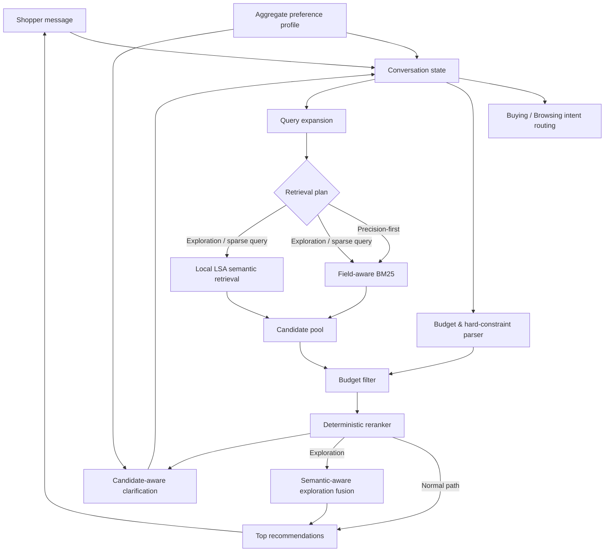

The core design is intentionally **lexical-first**. BM25 is the strongest standalone retriever on this catalogue, while semantic retrieval is used selectively when lexical overlap is weak or when the shopper is exploring.

---

# How a Shopping Session Works

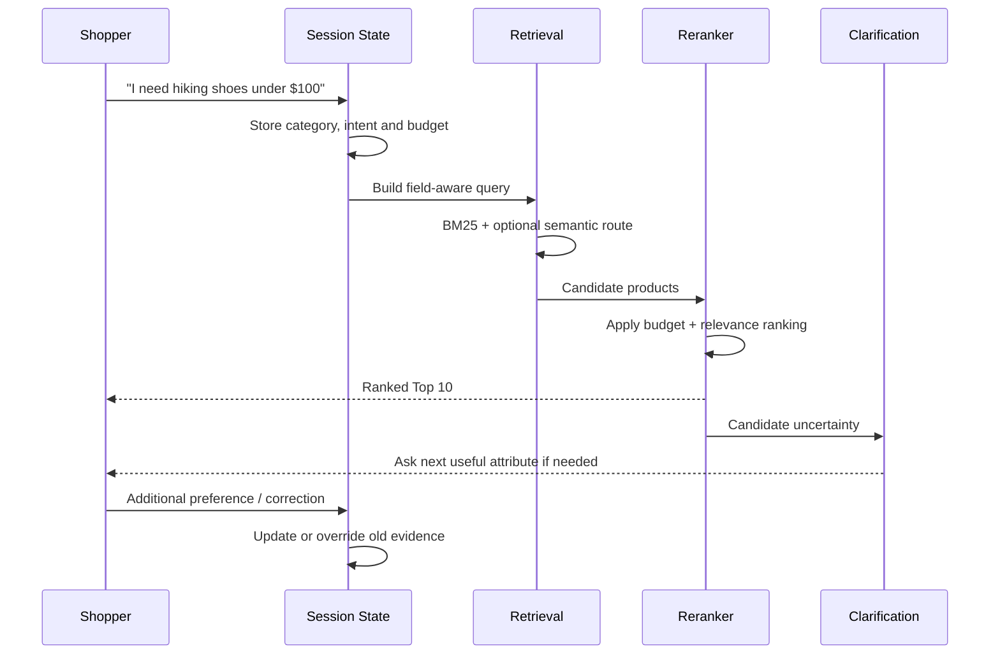

The agent does not treat each turn as a fresh search. It carries forward useful information, removes stale preferences when the shopper changes their mind, and changes retrieval behaviour as the conversation evolves.

---

# Features and Why We Added Them

## 1. Multi-Turn Conversational Memory

### What it does

The agent remembers useful information from earlier turns instead of searching only the latest message.

For example:

```text
Turn 1: "I'm looking for a jacket."
Turn 2: "Preferably black."
Turn 3: "Under $100."

Active intent:
category = jacket
color    = black
budget   = <= $100
```

### Why we added it

A shopping conversation is cumulative. If the system forgets the earlier product category every time the shopper adds a new detail, later searches become less relevant rather than more relevant.

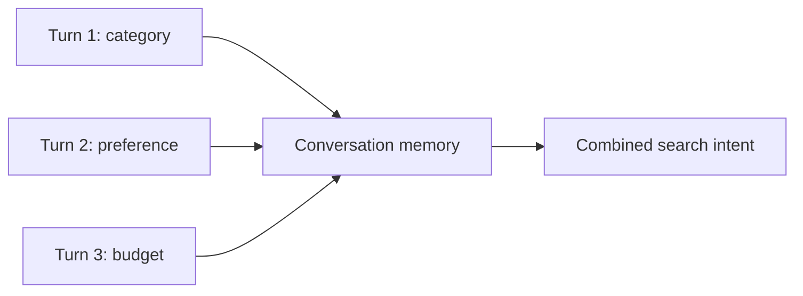

---

## 2. Category Preservation and Intent Overrides

### What it does

Product category and changeable preferences are handled separately. The system also detects when a shopper explicitly changes their mind using phrases such as:

* `actually...`
* `on second thought...`
* `never mind...`
* `scratch that...`
* `change of plan...`

When an override occurs, stale preference evidence is removed without losing the product category.

### Why we added it

A shopper changing from **red to black** should not make the system forget that they were shopping for **boots**.

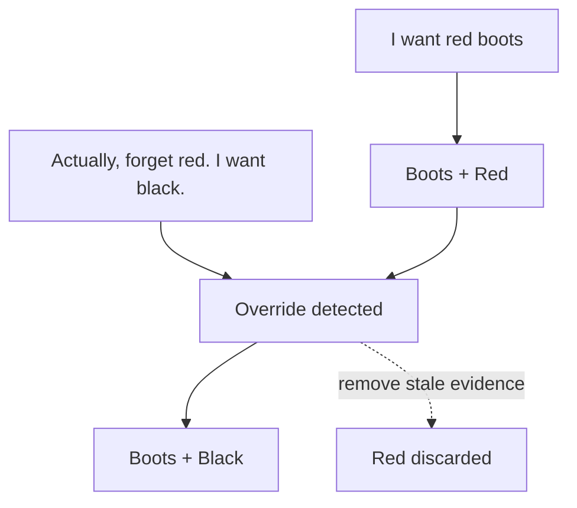

---

## 3. Buying vs Browsing Intent Routing

### What it does

The system distinguishes between shoppers who already know what they want and shoppers who are still exploring.

**Buying-style language** includes strong requirements such as:

* `I need...`
* `I prefer...`
* `I'd like...`
* `my budget is...`

**Browsing-style language** is broader and gives the retriever permission to explore a wider candidate space when necessary.

### Why we added it

A shopper saying **“I need waterproof hiking boots under $80”** should get a precise search. A shopper saying **“show me some jackets”** benefits from broader discovery.

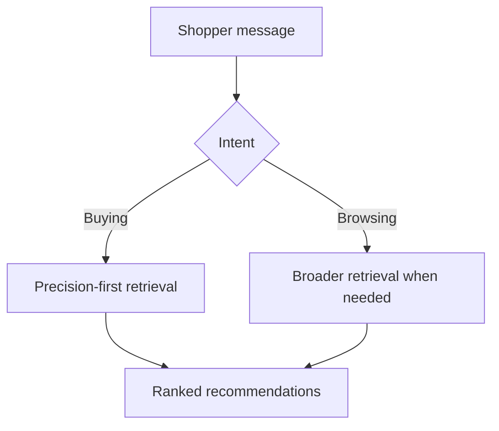

---

## 4. Field-Aware BM25 Retrieval

### What it does

BM25 is the main retrieval engine. Instead of flattening every product field and every user preference into one undifferentiated string, the search gives different evidence different roles.

Category-related terms are searched strongly against product titles/categories, while preference evidence can match richer catalogue fields such as features and descriptions.

### Why we added it

Product type is usually more important than a generic descriptive word. A perfect match on `waterproof` is not useful if the system accidentally returns a waterproof bag when the shopper asked for shoes.

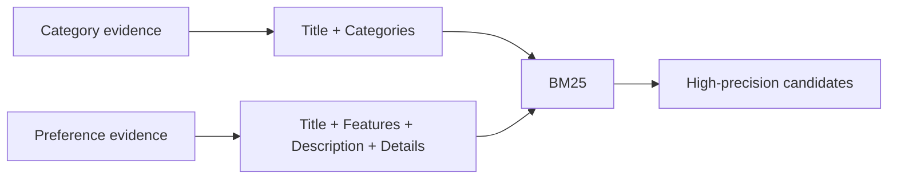

---

## 5. Domain Query Expansion

### What it does

The system expands selected shopper phrases into catalogue-style vocabulary before retrieval.

The clearest current example is water/moisture resistance:

```text
"heavy rain"
"wet conditions"
"resists moisture"
"keeps water out"
        ↓
waterproof
water resistant
water repellent
weatherproof
rainproof
moisture resistant
```

The original shopper wording is kept; canonical terms are only appended.

### Why we added it

Customers and product listings often describe the same idea differently. A shopper may say **“something for wet weather”**, while the product title simply says **“Water-Resistant”**. Without expansion, the correct product may never enter the candidate pool, which means no reranker can recover it later.

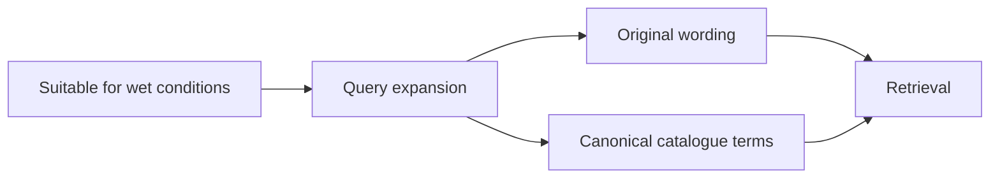

---

## 6. Lightweight Local Semantic Retrieval

### What it does

Alongside BM25, the system has a local semantic search representation built from the provided catalogue:

```text
Catalogue text
    ↓
TF-IDF (1-2 grams)
    ↓
TruncatedSVD / LSA
    ↓
96-dimensional normalized product vectors
```

Semantic assets are stored locally:

```text
assets/catalog_lsa.npy
assets/semantic_asins.json
assets/semantic_pipeline.joblib
```

### Why we added it

Keyword search is excellent when the shopper and catalogue use similar words, but weaker when they express the same meaning differently. LSA provides a lightweight semantic fallback without requiring a paid API or internet connection.

We deliberately **do not enable semantic retrieval everywhere**. Experiments showed that always-on dense retrieval can reduce ranking quality. It is most useful as a complementary exploration/recovery signal.

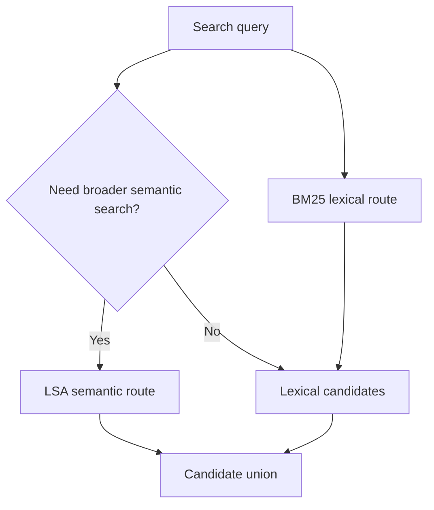

---

## 7. Hard Budget Constraints

### What it does

Budget is treated as a true filter, not merely another ranking hint.

The parser understands phrases such as:

* `under $80`
* `cheaper than $60`
* `capped at $90`
* `$50 to $100`
* `I can spend up to 120`
* `no budget limit`
* `price doesn't matter`

It also guards against obvious non-price measurements such as:

```text
"water resistant up to 30m"
"fits up to 8-inch wrist circumference"
```

Negated bounds such as `not under $80` are not silently converted into the opposite budget constraint.

### Why we added it

If the shopper says **“under $100”**, recommending a $180 product is not “slightly less relevant” — it is simply wrong.

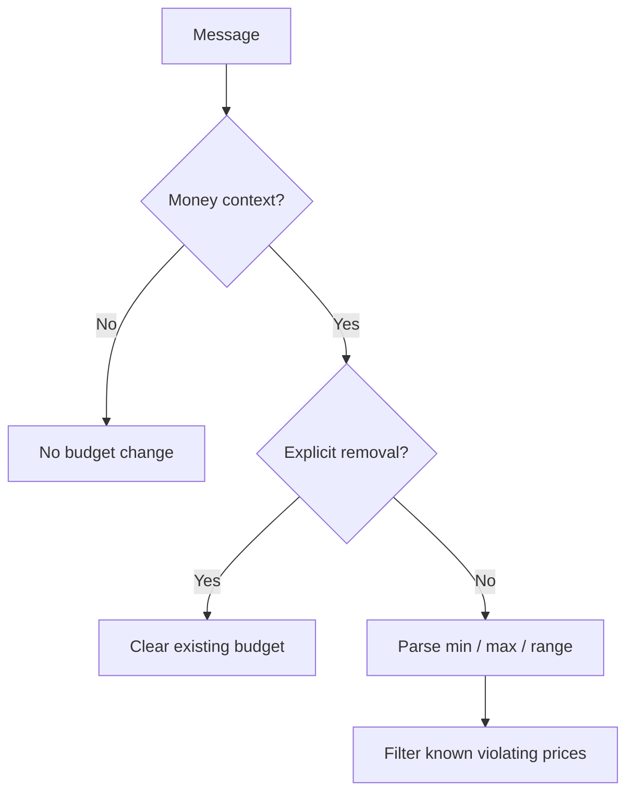

---

## 8. Constraint-Aware Deterministic Reranking

### What it does

Retrieval first finds a broad candidate pool. A deterministic reranker then decides which products deserve the highest positions using signals such as:

* category overlap;
* exact category phrase matches;
* accumulated preference coverage;
* exact evidence phrase matches;
* original retrieval order;
* popularity (`rating_number`) when products are otherwise tied.

### Why we added it

Finding the right product somewhere in the candidate pool is not enough. **MRR rewards putting it near the top.** The reranker separates candidate generation from final ordering so each component can focus on one job.

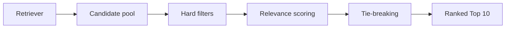

---

## 9. Adaptive Exploration and Semantic Fusion

### What it does

When the shopper has little more information to give, the system shifts from pure precision to exploration:

* the candidate pool becomes broader;
* previously shown products are avoided;
* semantic-only candidates can receive a bounded reciprocal-rank bonus;
* the semantic bonus is scaled relative to the current query's lexical relevance range;
* `average_rating` is used only as a final tie-break after stronger relevance signals are exhausted.

### Why we added it

Repeating the same ten highly similar products after the shopper rejects them is not useful. Exploration deliberately trades a small amount of certainty for additional coverage, while keeping semantic search subordinate to lexical relevance.

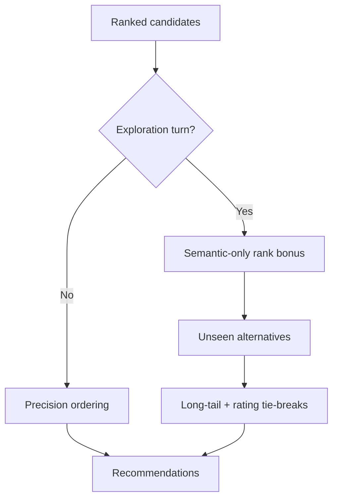

---

## 10. Candidate-Aware Clarification

### What it does

The agent can ask follow-up questions about allowed attributes such as:

* material;
* color;
* size;
* style;
* use case;
* feature.

Later in the conversation, candidate statistics are used to decide which dimension is worth asking about. Coverage and normalized entropy help identify attributes that meaningfully divide the current candidate set.

### Why we added it

A good shopping assistant should not ask a question just because a field exists. It should ask a question that can actually narrow the current choices.

For example, if almost every candidate is black, asking about color provides little information. If the candidates are evenly split between waterproof and non-waterproof products, asking about waterproofing is far more useful.

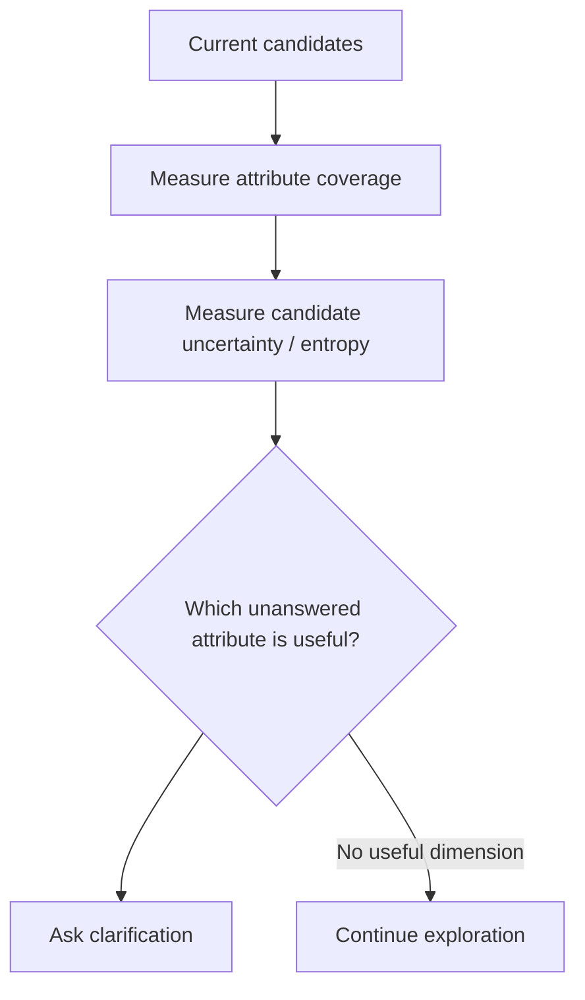

---

## 11. Safe Aggregate-Profile Personalization

### What it does

The evaluator provides a privacy-safe aggregate user profile. The system uses profile tags only as a **weak tie-break when choosing what to ask**, never as permission to invent a concrete preference.

Example:

```text
Profile says: material often matters to this shopper

Allowed:
→ slightly prefer asking about material when candidate-based
  question scores are nearly tied

Not allowed:
→ assume the shopper wants cotton
```

### Why we added it

Personalization is useful only when it does not override what the shopper is saying now. The current session always has higher priority than historical aggregate information.

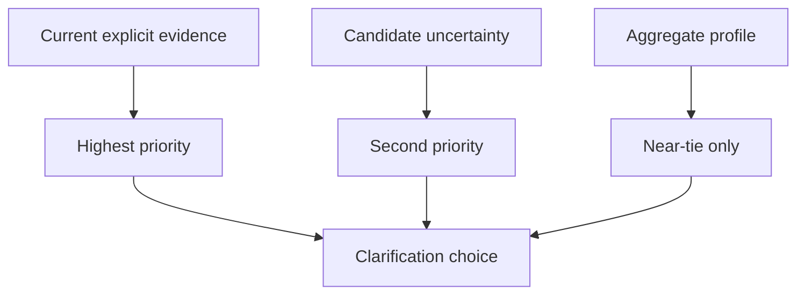

---

# Why We Chose a Lightweight Local Model Instead of an LLM

The challenge permits external LLM APIs and local models, but official scoring may run with restricted network access. Our final scored pipeline therefore does **not** depend on an external model service.

The semantic component is a lightweight local machine-learning model (TF-IDF + TruncatedSVD/LSA), while the rest of the agent is deterministic.

This gives us:

* **offline execution**;
* **zero API cost**;
* **zero prompt/completion token usage**;
* low operational complexity;
* reproducible recommendations;
* easier debugging and ablation testing;
* no risk of API/network failure during judging.

We experimented with more powerful neural semantic retrieval during development, but raw semantic improvements did not consistently translate into better end-to-end recommendation metrics. We therefore prioritized measurable session performance over adding a larger model for its own sake.

---

# Evaluation Strategy

We use two complementary evaluation layers.

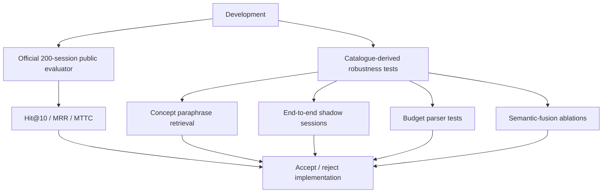

## Official public benchmark

The finalized system records:

| Metric          |       Result |
| --------------- | -----------: |
| Hit Rate@10     |   **1.0000** |
| MRR             | **0.815145** |
| MTTC            |    **2.035** |
| Technical Score | **0.923844** |

The public set is useful for regression protection, but once Hit Rate@10 reached 1.0 it became increasingly easy to overfit ranking decisions to the same 200 sessions.

## Catalogue-derived semantic robustness

To test less template-aligned language, we created a label-free concept benchmark using semantically equivalent product requirements.

Examples include:

```text
waterproof  → "something designed to keep water from getting through"
breathable  → "something that helps reduce heat buildup during wear"
non-slip    → "something with secure traction on slick surfaces"
```

On the 130-case concept benchmark:

| Route   |    Hit@10 |   Hit@100 |
| ------- | --------: | --------: |
| Lexical |     60.0% |     90.0% |
| Hybrid  | **61.5%** | **95.4%** |

The result reinforces our design choice: BM25 is still the strongest precision route, while semantic retrieval contributes additional recall.

## End-to-end robustness

On the broader conversational shadow evaluation, the adaptive pipeline achieved approximately **90.77% cumulative Hit@10**, with semantic/exploration behaviour rescuing additional sessions that failed on the initial recommendation set.

These robustness evaluations are deliberately kept separate from the official public labels so that changes are not accepted solely because they happen to fit the known 200 targets.

---

# Model Design Principles

### 1. Precision before breadth

We begin with the strongest high-precision route and broaden only when there is a reason to do so.

### 2. Candidate generation and ranking are different problems

Retrieval finds plausible products. Ranking decides which should appear first.

### 3. Hard constraints must remain hard

A known price violation is filtered rather than softly penalized.

### 4. Semantic search is a complement, not a replacement

Dense retrieval is useful for paraphrases, but unrestricted semantic promotion can hurt ranking quality.

### 5. Current intent beats historical profile

The shopper's current message always has priority over aggregate personalization.

### 6. Ask questions that can change the answer

Clarification should reduce uncertainty in the active candidate set.

### 7. Prefer measurable improvements over architectural complexity

Features are kept when they improve end-to-end behaviour or materially strengthen robustness without regressing protected metrics.

---

# Repository Layout

```text
.
├── assets/
│   ├── catalog_lsa.npy
│   ├── semantic_asins.json
│   └── semantic_pipeline.joblib
│
├── data/
│   ├── catalog.jsonl
│   └── public_set.jsonl
│
├── docs/
│   ├── agent_api_contract.json
│   ├── competition_specification.md
│   └── evaluation_config.json
│
├── evaluator/
│   └── local_evaluator.py
│
├── experiments/
│   └── reproducible evaluation outputs
│
├── scripts/
│   ├── build_semantic_index.py
│   ├── budget_constraint_eval.py
│   ├── concept_robustness_eval.py
│   ├── end_to_end_shadow_eval.py
│   └── semantic-fusion ablation utilities
│
├── src/
│   ├── dialogue.py
│   ├── fusion.py
│   ├── hard_constraints.py
│   ├── intent.py
│   ├── profile.py
│   ├── query_expansion.py
│   ├── questions.py
│   ├── reranker.py
│   ├── retrieval.py
│   ├── semantic.py
│   └── state.py
│
├── starter/
│   └── agent.py
│
└── tests/
```

---

# Setup

Python **3.10+** is recommended.

## 1. Create a virtual environment

```powershell
python -m venv .venv
.\.venv\Scripts\Activate.ps1
```

## 2. Install dependencies

```powershell
pip install -r requirements.txt
```

## 3. Prepare the catalogue

Download the frozen `catalog.jsonl.gz` from the competition release and extract it to:

```text
data/catalog.jsonl
```

## 4. Run tests

```powershell
python -m unittest -v
```

## 5. Run the official public evaluator

```powershell
python -m evaluator.local_evaluator --output experiments\latest_public_eval.json
```

## 6. Run robustness evaluations

```powershell
python -m scripts.concept_robustness_eval --cases 130 --output experiments\concept_robustness.json
python -m scripts.end_to_end_shadow_eval --output experiments\end_to_end_shadow.json
python -m scripts.budget_constraint_eval --output experiments\budget_constraint_eval.json
```

---

# Limitations

## Public benchmark saturation

The public 200-session set is extremely useful for regression testing, but a perfect public Hit Rate@10 does not imply perfect generalisation to the hidden 800 sessions.

## Performance declines as evaluation becomes broader

During development we observed that **both Hit Rate and MRR decrease when we evaluate on larger and/or more diverse data slices** rather than a narrow development subset. This is an important warning against reading too much into a saturated public score.

The catalogue-derived robustness benchmark also remains meaningfully harder than the public set. This suggests that the current system still has a generalisation gap, particularly for paraphrased requirements and long-tail products.

## Query expansion is intentionally narrow

Current hand-built synonym expansion focuses mainly on moisture/water-resistance language because it represented the clearest concentration of residual retrieval failures. Other domains can still suffer from vocabulary mismatch.

## Semantic model capacity is limited

LSA is lightweight, fast and offline, but it cannot represent language as deeply as a modern transformer embedding model.

## Budget parsing is rule-based

The parser handles broad common language and explicit budget removal, but very unusual or semantically distant negation can still be difficult.

## Catalogue metadata is imperfect

Some fields are sparse or inconsistently populated. The system therefore avoids assuming that missing metadata means a product lacks an attribute.

---

# Future Work

The next improvements should focus on **generalisation**, not simply extracting more score from the same public sessions.

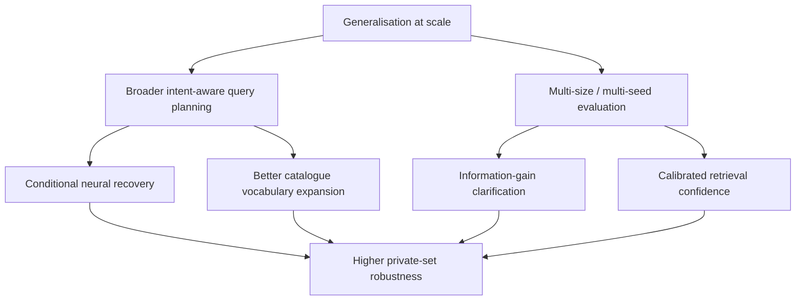

## 1. Measure and reduce the dataset-size generalisation gap

The most important future task is to understand why **Hit Rate and MRR fall as the evaluation set becomes larger and more varied**.

Rather than evaluating one fixed slice, future work should produce learning/generalisation curves across multiple sample sizes and random seeds:

```text
50 cases → 100 → 250 → 500 → 1000+
```

This would help distinguish real improvements from changes that only work on a convenient subset.

## 2. Broader intent-aware query planning

Current query expansion is manually focused on one strong failure cluster. A better approach would map many natural shopper expressions into canonical catalogue concepts before retrieval, for example:

```text
"helps reduce heat buildup" → breathable
"secure traction"          → non-slip
"for cold weather"         → insulated / winter
"easy to adjust"           → adjustable
```

The important constraint is that these canonical terms should help **candidate generation** without taking control of final ranking.

## 3. Conditional neural semantic recovery

A small local transformer such as a sentence-embedding model could be useful as a **fallback**, rather than running on every query.

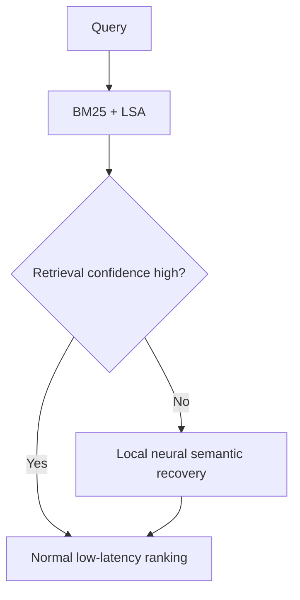

This keeps normal queries fast while giving difficult paraphrases access to a stronger semantic model. Any neural addition should only be adopted if it improves end-to-end Hit Rate/MRR enough to justify the latency and memory cost.

## 4. Expected-information-gain clarification

The current clarification strategy already looks at candidate uncertainty. Future work could make this more explicit by estimating how many candidates each possible answer would remove and selecting the question with the highest expected information gain.

This may reduce MTTC by asking fewer low-value questions.

## 5. Learned but bounded reranking

A lightweight learned reranker could combine lexical relevance, semantic rank, popularity, rating, and structured constraints. However, previous experiments showed that aggressive semantic reranking can reduce MRR, so any learned component should operate under strict guardrails and preserve strong lexical matches.

## 6. Safer structured product understanding

More catalogue attributes could be extracted into structured product profiles with provenance from title, features, descriptions and selected details fields. This could improve explanations and constraint matching while treating missing evidence as **unknown**, not negative.

## 7. Transparent recommendation explanations

Because the current pipeline already has structured query evidence, future responses could explain why products were recommended:

```text
Why this product?
✓ Matches requested product category
✓ Under your stated budget
✓ Water-resistant listing evidence
✓ Strong match to your current preferences
```

This would make the copilot easier to trust without changing the core retrieval score.

---

# Final Takeaway

Our final system is deliberately not a single large model. It is a **hybrid conversational search pipeline** where each component has a clear role:

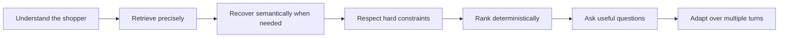

The result is an offline-capable shopping copilot that reaches **100% Hit Rate@10 on the released public sessions** while remaining reproducible, low-cost, and explicitly designed to handle multi-turn shopping behaviour.

Our next priority is not to over-optimize the known public set, but to close the observed **Hit Rate and MRR generalisation gap as evaluation data becomes larger and more diverse**.

---

## Data Attribution

The frozen catalogue and evaluation sessions are derived from **Amazon Reviews 2023** by McAuley Lab, UCSD. See `DATA_ATTRIBUTION.md` for the repository's full attribution and redistribution notes.
