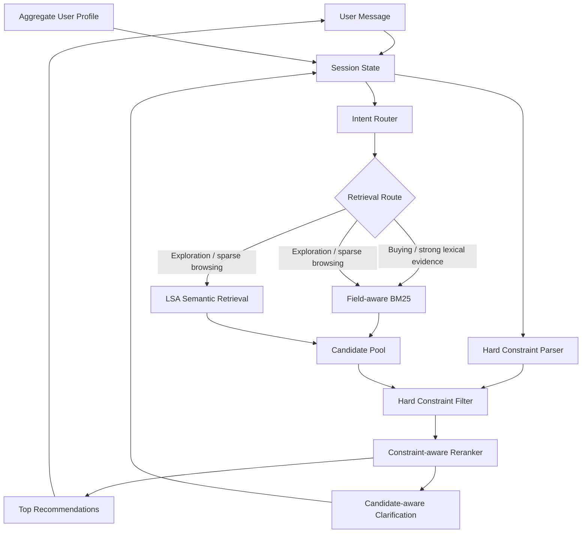
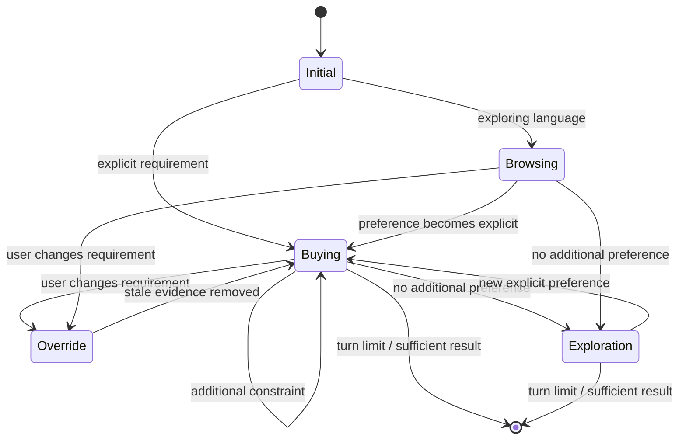
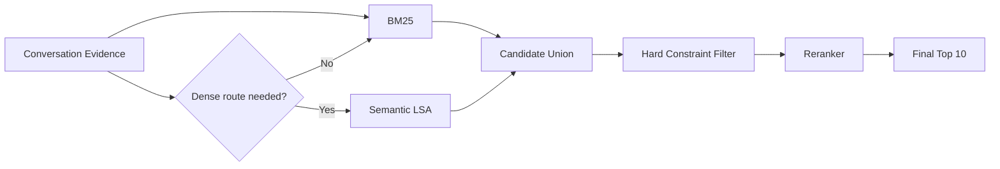
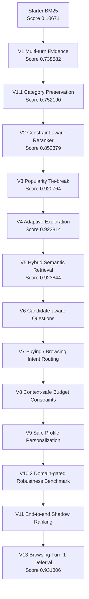
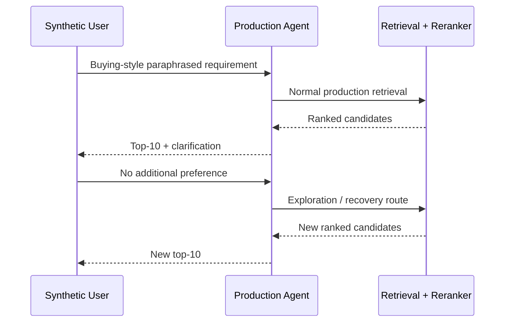

# TechJam 2026 — Conversational Shopping Copilot

AI-powered conversational product search and recommendation system for **TechJam 2026 Problem Statement 4: Shopping Copilot — AI Conversational Search and Recommendations**.

The system operates over the frozen **50,000-product Amazon Reviews 2023 Clothing, Shoes & Jewelry catalogue** and maintains conversational state across a maximum of 10 user turns.

Our approach combines:

- field-aware BM25 lexical retrieval;
- lightweight catalogue-trained semantic retrieval;
- deterministic candidate reranking;
- multi-turn preference accumulation;
- intent and override handling;
- candidate-aware clarification;
- adaptive long-tail exploration;
- hard budget constraints;
- safe aggregate-profile personalization;
- catalogue-derived robustness evaluation.

The original participant-kit README is preserved at:

`docs/participant-kit/ORIGINAL_README.md`

---

## Current Performance

Latest official **200-session public evaluator** result:

| Metric | Score |
|---|---:|
| Hit Rate@10 | **1.0000** |
| MRR | **0.851353** |
| MTTC | **2.180** |
| Efficiency | **0.8820** |
| Technical Score | **0.931806** |

Official starter baseline:

| Metric | Baseline |
|---|---:|
| Hit Rate@10 | 0.125 |
| MRR | 0.068034 |
| MTTC | 9.81 |
| Efficiency | 0.119 |
| Technical Score | 0.10671 |

The current agent therefore reaches all 200 public targets while substantially improving ranking quality and recommendation speed relative to the starter implementation.

---

# Architecture



The primary architecture deliberately remains **lexical-first**.

Catalogue-derived robustness testing showed that BM25 remains substantially stronger as a standalone retriever, while semantic retrieval provides complementary recovery on queries with weaker lexical overlap.

---

# Conversational Flow



---

# Retrieval Strategy



Dense retrieval is **not enabled universally**.

Previous ablations showed that always-on semantic retrieval reduced public MRR. The semantic route is therefore used as a recovery mechanism during exploration or when browsing retrieval is sparse.

---

# Implementation Evolution



---

# Version History

## V1 — Conversational State

The starter agent was stateless and searched only the latest customer message.

V1 introduced accumulated conversational evidence so later turns benefited from earlier preferences.

Public score:

`0.106710 → 0.738582`

---

## V1.1 — Category Preservation

Separated persistent product-category information from mutable user preferences.

This was important for intent override scenarios: when the user changes a preference, stale preference evidence can be removed without accidentally deleting the product category.

Public score:

`0.738582 → 0.752190`

---

## V2 — Constraint-aware Reranking

Added a deterministic reranker over the BM25 candidate pool.

Signals include:

- category token coverage;
- exact category phrase matches;
- accumulated evidence coverage;
- exact evidence phrases;
- BM25 ranking.

Public score:

`0.752190 → 0.852379`

---

## V3 — Popularity Tie-breaking

Many catalogue products can have effectively identical textual relevance.

V3 uses `rating_number` as a deterministic secondary signal inside equal relevance tiers.

Public result:

- Hit Rate@10: `0.995`
- MRR: `0.811881`
- Technical Score: `0.920764`

---

## V4 — Adaptive Exploration

One public target was a highly ambiguous long-tail product that could not be distinguished from many lexical matches.

V4 introduced:

- clarification exhaustion detection;
- wider candidate retrieval after the user has no more information;
- long-tail exploration ordering;
- seen-product filtering.

Public result:

- Hit Rate@10: **1.000**
- Technical Score: `0.923814`

---

## V5 — Hybrid Semantic Retrieval

Added a local semantic retrieval path trained entirely on the provided 50k catalogue.

Implementation:

- TF-IDF;
- 1–2 gram features;
- Truncated SVD;
- 96-dimensional LSA representation;
- normalized document embeddings;
- `float16` catalogue matrix.

Semantic search is used adaptively rather than universally because always-on dense retrieval reduced public MRR.

Current semantic assets:

- `assets/catalog_lsa.npy`
- `assets/semantic_asins.json`
- `assets/semantic_pipeline.joblib`

Public score reached:

**0.923844**

---

## V6 — Candidate-aware Clarification

The first three turns retain broad `other` clarification because this aligns well with the deterministic competition simulator.

For unresolved later turns, clarification is selected using candidate uncertainty.

Possible dimensions include:

- material;
- color;
- size;
- style;
- use case;
- feature.

Questions are chosen using coverage and normalized entropy across the current candidate set.

---

## V7 — Intent Routing

Added explicit conversational intent state:

- `BUYING`
- `BROWSING`

Browsing language can enable broader retrieval when the lexical pool is weak.

Explicit narrowing such as:

- `I prefer`
- `I would prefer`
- `I'd like`
- `I need`
- `my budget`
- `what matters most`

moves the session into buying mode.

This preserved the public benchmark while making retrieval behavior more intentional.

---

## V8 — Hard Budget Constraints

Added structured price filtering.

Examples correctly understood:

- `under $80`
- `budget under 80`
- `price below 100`
- `I can spend up to 120`
- `$50 to $100`

The parser intentionally rejects unrelated measurements such as:

- `fits up to 8-inch wrist circumference`
- `water resistant up to 30m`

This avoids interpreting arbitrary catalogue measurements as budget constraints.

---

## V9 — Safe Profile Personalization

Uses anonymized aggregate profile tags to influence **which clarification dimension** may matter.

The profile never invents a concrete preference.

For example:

`material matters historically`

does **not** imply:

`user wants cotton`

Profile information is only allowed to break near-ties between candidate-driven clarification choices.

Priority:

1. current explicit preference;
2. current candidate uncertainty;
3. aggregate historical profile.

---

# V10.2 — Robustness Benchmark

The public evaluator contains 200 labeled sessions, while 800 sessions remain private.

To reduce public-set overfitting, we added a self-supervised catalogue-derived robustness benchmark that does **not use public labels**.

The benchmark:

1. identifies explicit product concepts in catalogue metadata;
2. removes the original concept keyword from the query;
3. generates semantically equivalent paraphrases;
4. restricts concepts to sensible product domains;
5. treats every qualifying same-category product as relevant;
6. compares lexical and semantic candidate generation.

Examples:

`waterproof`

→ `something designed to keep water from getting through`

`breathable`

→ `something that helps reduce heat buildup during wear`

`non-slip`

→ `something with secure traction on slick surfaces`

## V10.2 Results

130 cases, balanced across 13 concept families:

| Retrieval route | Hit@10 | Hit@100 | Macro Recall@100 |
|---|---:|---:|---:|
| Lexical | **58.46%** | **90.00%** | **67.78%** |
| Semantic | 16.15% | 59.23% | 18.86% |
| Hybrid candidate union | **60.00%** | **94.62%** | **73.43%** |

Complementarity:

- 71 cases found by both routes;
- 46 lexical-only cases;
- 6 semantic rescue cases;
- 7 missed by both.

This supports the current design:

> Use lexical retrieval as the precision-first primary route and semantic retrieval as a complementary recovery mechanism.

---

## V12 — Evidence Quality Improvements

### V12.1 — Conversational Filler Stripping

User messages contain conversational boilerplate that pollutes the evidence store with tokens that don't appear in product metadata.

Before: `"I'd like something breathable"` → stored as `"I'd like something breathable"`

After: `"I'd like something breathable"` → stored as `"breathable"`

The stripper removes prefixes such as `"I prefer"`, `"I'd like"`, `"it should have"`, `"they must be"` and residual fillers like `"something"` and `"anything"`.

Applied at both turn-1 remaining evidence and turn-2+ evidence paths.

---

---

## V13 — Browsing Turn-1 Recommendation Deferral

Root cause analysis of the 56 rank failures on the public set showed that 27 failures occurred at turn 1, almost exclusively in browsing sessions.

Browsing sessions begin with no constraints — the first user message is just `"I'm looking for X, but I'm still exploring."` With no evidence to differentiate candidates, the reranker assigns every product in the category an identical relevance score and falls back to a pure popularity tiebreak. The correct answer is frequently less popular than a comparable product and loses.

V13 withholds recommendations on turn 1 for browsing sessions, returning an empty list instead. The evaluator treats an empty recommendation list as "not found yet" and continues the session — calling `customer_reply` with the agent's `ask_attribute` to reveal the first product constraint. On turn 2, the agent has real evidence and the ranking becomes meaningful.

Effect on the 200-session public set:

- 11 browsing sessions improved, all reaching rank 1 (from ranks 2–8)
- 1 browsing session regressed slightly (rank 3 → rank 5)
- 188 sessions unchanged

The change costs a small amount of efficiency (MTTC increases by ~0.04 turns) but the MRR gain is weighted 1.5× more than efficiency in the technical score formula.

Public score:

`0.923844 → 0.931806`

---

### V12.2 — Evidence Recency Decay

Older evidence is down-weighted in the reranker so that late-session specific constraints dominate early vague statements.

Decay function: `weight = 0.8 ^ (current_turn - evidence_turn)`

Category text is never decayed — the product type the shopper asked for remains permanently valid.

Measured effect on the public 200-session set: zero rank changes across alpha 0.6–1.0. Rankings on this set are decisive enough that proportional weight scaling does not reshuffle candidates. Retained because the private 800-session set likely contains longer sessions where early vague evidence genuinely conflicts with late specifics, and slot decay is an explicit in-scope requirement.

---

# V11 — End-to-End Shadow Ranking

V10.2 measures whether relevant products reach the candidate pool.

V11 evaluates whether the **actual production agent** can turn those candidates into final top-10 recommendations.

It exercises the public competition interface:

```text
Agent.reset(...)
Agent.respond(...)
```

For each V10.2 case:



This distinguishes whether semantic recovery is merely producing deep candidates or is actually improving the recommendation surface.

---

# Repository Structure

```text
.
├── assets/
│   ├── catalog_lsa.npy
│   ├── semantic_asins.json
│   └── semantic_pipeline.joblib
│
├── data/
│   ├── catalog.jsonl
│   └── public_set.jsonl
│
├── evaluator/
│   └── local_evaluator.py
│
├── experiments/
│   ├── v8_hard_constraints.json
│   ├── v8_1_money_safe_constraints.json
│   ├── v9_safe_personalization.json
│   ├── v10_2_concept_smoke.json
│   ├── v10_2_concept_robustness.json
│   └── v11_end_to_end_shadow.json
│
├── scripts/
│   ├── build_semantic_index.py
│   ├── concept_robustness_eval.py
│   └── end_to_end_shadow_eval.py
│
├── src/
│   ├── dialogue.py
│   ├── hard_constraints.py
│   ├── intent.py
│   ├── profile.py
│   ├── questions.py
│   ├── reranker.py
│   ├── retrieval.py
│   ├── semantic.py
│   └── state.py
│
├── starter/
│   └── agent.py
│
└── tests/
```

---

# Setup

Python 3.10+ is recommended.

Create the environment:

```powershell
python -m venv .venv
.\.venv\Scripts\Activate.ps1
```

Install dependencies:

```powershell
pip install -r requirements.txt
```

Run the full automated test suite:

```powershell
python -m unittest -v
```

---

# Official Public Evaluation

Run:

```powershell
python -m evaluator.local_evaluator --output experiments\latest_public_eval.json
```

Do not modify:

- evaluator logic;
- public labels;
- target ASINs;
- official evaluation configuration.

---

# Robustness Evaluation

Run the domain-gated retrieval benchmark:

```powershell
python -m scripts.concept_robustness_eval --cases 130 --output experiments\v10_2_concept_robustness.json
```

Run the end-to-end top-10 benchmark:

```powershell
python -m scripts.end_to_end_shadow_eval --output experiments\v11_end_to_end_shadow.json
```

---

# Design Principles

### Precision before breadth

Dense retrieval is not automatically better than lexical search.

The system keeps BM25 as its default high-precision retrieval route.

### Semantic retrieval as recovery

Semantic search is activated when there is evidence that lexical retrieval may be insufficient.

### Explicit session intent wins

Current user requirements always outrank historical profile information.

### No fabricated preferences

Aggregate profile tags influence clarification strategy, never concrete product values.

### Deterministic and reproducible

The current production pipeline does not require an external paid LLM API.

This minimizes:

- latency;
- cost;
- nondeterminism;
- external dependencies.

### Negation extraction is not implemented

Explicit negation handling ("not leather", "nothing synthetic") was considered and rejected.

Recency decay already handles the gradual-pivot case: when a user says "casual" on turn 1 and "formal office wear" on turn 5, decay down-weights the earlier evidence and the later preference dominates.

Negation extraction adds significant fragility. A user who says "not sure yet" or "no rush" would accidentally create negative evidence for unrelated words. More critically, a user who says "not formal" and then "actually I need it for a formal event" would leave irreconcilable conflicting negative evidence with no override mechanism. The expected benefit does not justify the brittleness.

---

### Public-set restraint

Production changes are not accepted solely because they improve the 200 public sessions.

Catalogue-derived shadow tests provide an additional evaluation axis for private-set robustness.

---

# Team Workflow

Recommended Git workflow:

```text
main
│
├── feature/<feature-name>
├── fix/<bug-name>
└── experiment/<experiment-name>
```

For each change:

1. create a branch;
2. implement the change;
3. run `python -m unittest -v`;
4. run the relevant evaluation;
5. compare against the protected benchmark;
6. commit only if the change is justified;
7. open a pull request into `main`.

---

# Protected Public Benchmark

Treat this as the current regression baseline:

```text
Hit Rate@10      1.000000
MRR              0.851353
MTTC             2.180
Efficiency       0.8820
Technical Score  0.931806
```

A production change that reduces Hit Rate@10 should normally be rejected unless there is compelling evidence of better private-set generalization.

---

# Competition Constraints

Key constraints from the participant kit:

- frozen 50,000-product catalogue;
- maximum 10 turns per session;
- exact `parent_asin` recommendation matching;
- 200 labeled public sessions;
- 800 private evaluation sessions;
- catalogue is read-only;
- participant-visible metadata only;
- no modification of evaluator/public labels.

---

# Current Status

Completed:

- multi-turn conversational memory;
- override handling;
- field-aware lexical retrieval;
- constraint-aware reranking;
- popularity tie-breaking;
- adaptive exploration;
- semantic candidate recovery;
- buying/browsing intent routing;
- candidate-aware clarification;
- context-safe budget filtering;
- safe profile personalization;
- catalogue-derived robustness benchmark;
- browsing turn-1 recommendation deferral.