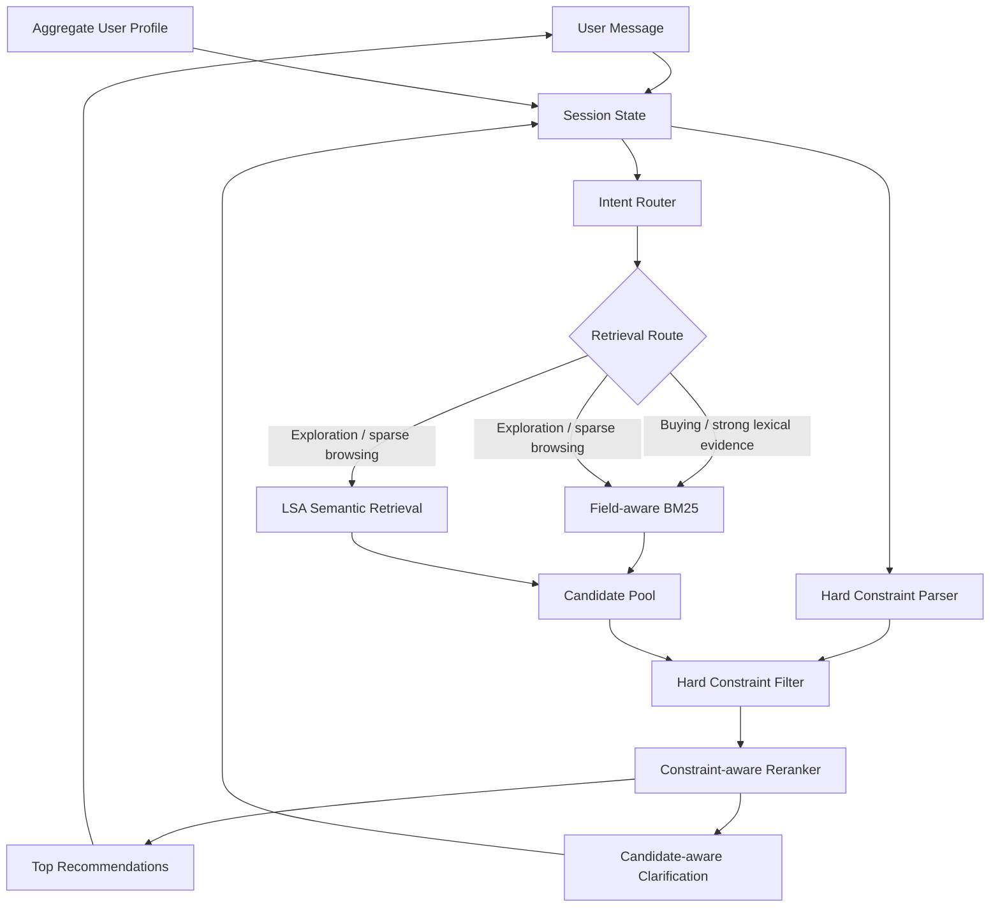
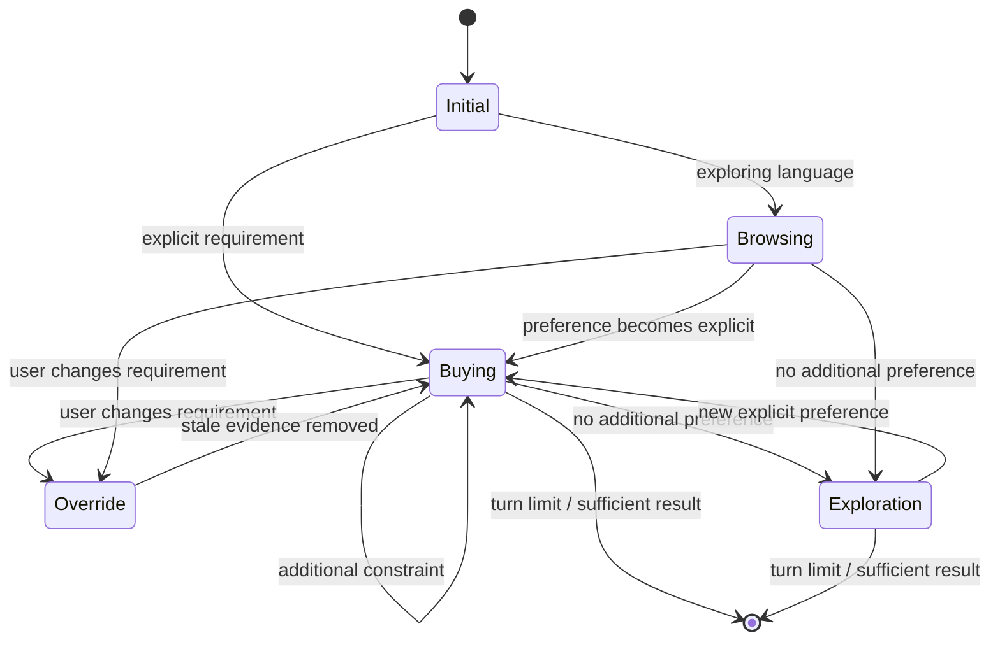
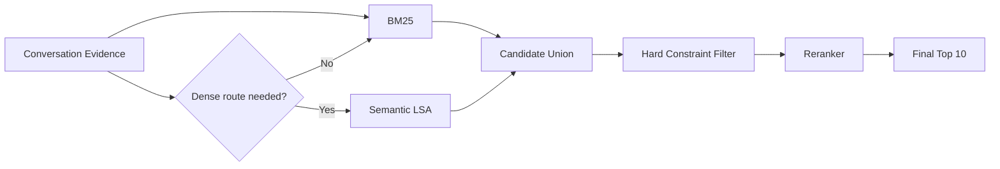
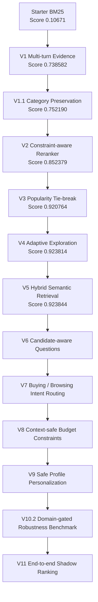
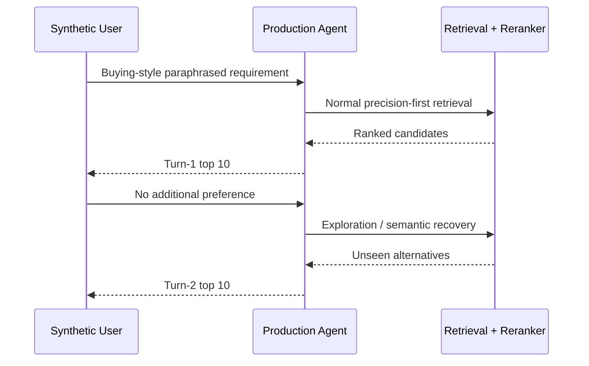

# TechJam 2026 — Conversational Shopping Copilot

AI-powered conversational product search and recommendation system for **TechJam 2026 Problem Statement 4: Shopping Copilot — AI Conversational Search and Recommendations**.

The system operates over the frozen **50,000-product Amazon Reviews 2023 Clothing, Shoes & Jewelry catalogue** and maintains conversational state across a maximum of 10 user turns.

Our approach combines:

- field-aware BM25 lexical retrieval;
- lightweight catalogue-trained semantic retrieval;
- deterministic candidate reranking;
- multi-turn preference accumulation;
- intent and override handling;
- candidate-aware clarification;
- adaptive long-tail exploration;
- hard budget constraints;
- safe aggregate-profile personalization;
- catalogue-derived robustness evaluation.

The original participant-kit README is preserved at:

`docs/participant-kit/ORIGINAL_README.md`

---

## Current Performance

Latest official **200-session public evaluator** result:

| Metric | Score |
|---|---:|
| Hit Rate@10 | **1.0000** |
| MRR | **0.815145** |
| MTTC | **2.035** |
| Efficiency | **0.8965** |
| Technical Score | **0.923844** |

Official starter baseline:

| Metric | Baseline |
|---|---:|
| Hit Rate@10 | 0.125 |
| MRR | 0.068034 |
| MTTC | 9.81 |
| Efficiency | 0.119 |
| Technical Score | 0.10671 |

The current agent therefore reaches all 200 public targets while substantially improving ranking quality and recommendation speed relative to the starter implementation.

---

# Architecture



The primary architecture deliberately remains **lexical-first**.

Catalogue-derived robustness testing showed that BM25 remains substantially stronger as a standalone retriever, while semantic retrieval provides complementary recovery on queries with weaker lexical overlap.

---

# Conversational Flow



---

# Retrieval Strategy



Dense retrieval is **not enabled universally**.

Previous ablations showed that always-on semantic retrieval reduced public MRR. The semantic route is therefore used as a recovery mechanism during exploration or when browsing retrieval is sparse.

---

# Implementation Evolution



---

# Version History

## V1 — Conversational State

The starter agent was stateless and searched only the latest customer message.

V1 introduced accumulated conversational evidence so later turns benefited from earlier preferences.

Public score:

`0.106710 → 0.738582`

---

## V1.1 — Category Preservation

Separated persistent product-category information from mutable user preferences.

This was important for intent override scenarios: when the user changes a preference, stale preference evidence can be removed without accidentally deleting the product category.

Public score:

`0.738582 → 0.752190`

---

## V2 — Constraint-aware Reranking

Added a deterministic reranker over the BM25 candidate pool.

Signals include:

- category token coverage;
- exact category phrase matches;
- accumulated evidence coverage;
- exact evidence phrases;
- BM25 ranking.

Public score:

`0.752190 → 0.852379`

---

## V3 — Popularity Tie-breaking

Many catalogue products can have effectively identical textual relevance.

V3 uses `rating_number` as a deterministic secondary signal inside equal relevance tiers.

Public result:

- Hit Rate@10: `0.995`
- MRR: `0.811881`
- Technical Score: `0.920764`

---

## V4 — Adaptive Exploration

One public target was a highly ambiguous long-tail product that could not be distinguished from many lexical matches.

V4 introduced:

- clarification exhaustion detection;
- wider candidate retrieval after the user has no more information;
- long-tail exploration ordering;
- seen-product filtering.

Public result:

- Hit Rate@10: **1.000**
- Technical Score: `0.923814`

---

## V5 — Hybrid Semantic Retrieval

Added a local semantic retrieval path trained entirely on the provided 50k catalogue.

Implementation:

- TF-IDF;
- 1–2 gram features;
- Truncated SVD;
- 96-dimensional LSA representation;
- normalized document embeddings;
- `float16` catalogue matrix.

Semantic search is used adaptively rather than universally because always-on dense retrieval reduced public MRR.

Current semantic assets:

- `assets/catalog_lsa.npy`
- `assets/semantic_asins.json`
- `assets/semantic_pipeline.joblib`

Public score reached:

**0.923844**

---

## V6 — Candidate-aware Clarification

The first three turns retain broad `other` clarification because this aligns well with the deterministic competition simulator.

For unresolved later turns, clarification is selected using candidate uncertainty.

Possible dimensions include:

- material;
- color;
- size;
- style;
- use case;
- feature.

Questions are chosen using coverage and normalized entropy across the current candidate set.

---

## V7 — Intent Routing

Added explicit conversational intent state:

- `BUYING`
- `BROWSING`

Browsing language can enable broader retrieval when the lexical pool is weak.

Explicit narrowing such as:

- `I prefer`
- `I would prefer`
- `I'd like`
- `I need`
- `my budget`
- `what matters most`

moves the session into buying mode.

This preserved the public benchmark while making retrieval behavior more intentional.

---

## V8 — Hard Budget Constraints

Added structured price filtering.

Examples correctly understood:

- `under $80`
- `budget under 80`
- `price below 100`
- `I can spend up to 120`
- `$50 to $100`

The parser intentionally rejects unrelated measurements such as:

- `fits up to 8-inch wrist circumference`
- `water resistant up to 30m`

This avoids interpreting arbitrary catalogue measurements as budget constraints.

---

## V9 — Safe Profile Personalization

Uses anonymized aggregate profile tags to influence **which clarification dimension** may matter.

The profile never invents a concrete preference.

For example:

`material matters historically`

does **not** imply:

`user wants cotton`

Profile information is only allowed to break near-ties between candidate-driven clarification choices.

Priority:

1. current explicit preference;
2. current candidate uncertainty;
3. aggregate historical profile.

---

# V10.2 — Robustness Benchmark

The public evaluator contains 200 labeled sessions, while 800 sessions remain private.

To reduce public-set overfitting, we added a self-supervised catalogue-derived robustness benchmark that does **not use public labels**.

The benchmark:

1. identifies explicit product concepts in catalogue metadata;
2. removes the original concept keyword from the query;
3. generates semantically equivalent paraphrases;
4. restricts concepts to sensible product domains;
5. treats every qualifying same-category product as relevant;
6. compares lexical and semantic candidate generation.

Examples:

`waterproof`

→ `something designed to keep water from getting through`

`breathable`

→ `something that helps reduce heat buildup during wear`

`non-slip`

→ `something with secure traction on slick surfaces`

## V10.2 Results

130 cases, balanced across 13 concept families:

| Retrieval route | Hit@10 | Hit@100 | Macro Recall@100 |
|---|---:|---:|---:|
| Lexical | **58.46%** | **90.00%** | **67.78%** |
| Semantic | 16.15% | 59.23% | 18.86% |
| Hybrid candidate union | **60.00%** | **94.62%** | **73.43%** |

Complementarity:

- 71 cases found by both routes;
- 46 lexical-only cases;
- 6 semantic rescue cases;
- 7 missed by both.

This supports the current design:

> Use lexical retrieval as the precision-first primary route and semantic retrieval as a complementary recovery mechanism.

---

# V11 — End-to-End Shadow Ranking

V10.2 measures whether relevant products enter the candidate pool.

V11 exercises the actual production interface:

```text
Agent.reset(...)
Agent.respond(...)
```

against the same catalogue-derived paraphrase benchmark and measures the final top-10 recommendations shown to the user.



## V11 Results

Across the 130 domain-gated shadow cases:

| Metric | Result |
|---|---:|
| Turn-1 Hit@10 | **77.69%** |
| Turn-1 MRR@10 | **0.4988** |
| New turn-2 rescues | **14** |
| Cumulative hit by turn 2 | **88.46%** |
| Rescue rate among initial misses | **48.28%** |
| Missed after both turns | **15 / 130** |

The production agent deliberately avoids repeating already-seen products during exploration. Therefore a turn-1 hit remains a successful session even when the target is not repeated on turn 2.

V11 shows that exploration is valuable: almost half of the cases that missed on the first recommendation set were recovered by the second.

However, semantic promotion remains an opportunity. Of the six V10.2 cases in which semantic retrieval found a relevant product that lexical retrieval completely missed at depth 100, only one was promoted into the final top 10 during exploration.

This motivates the next experiment:

> Improve semantic candidate fusion during exploration without changing the protected turn-1 lexical ranking path.

## V12 — Semantic-Aware Exploration Fusion

V11 showed that semantic retrieval could recover products missed by lexical search, but many semantic-only candidates were not promoted into the final recommendation set.

V12 adds a bounded semantic reciprocal-rank signal during **exploration only**. The normal buying path remains unchanged.

Semantic promotion is deliberately conservative:

- only semantic-only candidates receive the bonus;
- hybrid/lexical candidates receive no additional semantic boost;
- candidates must remain compatible with the active product category;
- semantic retrieval rank is used instead of raw cosine similarity;
- the feature activates only during exploration.

A label-free ablation tested weights from `0.0` to `1.5`. A weight of `1.0` was selected because it was the smallest value that improved session coverage while preserving ranking quality.

| Metric | V11 | V12 |
|---|---:|---:|
| Shadow Turn-1 Hit@10 | 77.69% | 77.69% |
| Shadow cumulative Hit@10 | 88.46% | **89.23%** |
| Turn-2 rescues | 14 | **15** |
| Remaining misses | 15 | **14** |
| Semantic-only rescues | 1 / 6 | **2 / 6** |
| Public Hit@10 | 1.000 | **1.000** |
| Public MRR | 0.815145 | **0.815145** |
| Public TechnicalScore | 0.923844 | **0.923844** |

The result suggests semantic retrieval is useful as a targeted recovery mechanism, but should remain subordinate to the stronger lexical relevance path.

---

## V13 — Semantic Fallback for Override Detection

Override detection (`src/intent.py`, `src/state.py`) previously relied on literal regex/substring matching keyed almost entirely to one exact sentence template from `evaluator/local_evaluator.py`. A dedicated robustness test (`tests/test_override_robustness.py`) showed only 2/10 realistic paraphrases ("scratch that", "disregard", dropping the word "actually", plain buying language) triggered the full override behavior.

V13 makes override detection two-stage:

1. A broadened, free, deterministic regex stage (`REVERSAL_PATTERNS` in `src/intent.py`) — no longer requires the word "actually", and covers several common reversal cues (ignore/disregard/forget, scratch that, never mind, changed my mind, on second thought) instead of one literal sentence.
2. A local, offline semantic fallback (`src/override_semantic.py`) for phrasing outside that list — a small pretrained sentence-embedding model (`all-MiniLM-L6-v2`) scored by **margin** between a positive (reversal) and negative (ordinary preference / decline-to-answer) exemplar set, not by absolute similarity to positives alone.

The margin design exists because absolute similarity did not work: empirically, ordinary shopping-preference sentences — especially the evaluator's own "I don't have a preference for X" boilerplate — scored as high or higher than genuine overrides against a positive-only exemplar set (see `scripts/tune_override_threshold.py`). A general-purpose sentence embedding mostly captures shared topic ("this is about a shopping preference"), not the specific pragmatic act being performed, so a positive/negative margin was needed instead of one threshold.

The broadened regex list alone now resolves all 10 known paraphrases in the test corpus; the semantic stage is a fallback for phrasing beyond that list.

**Chosen over an external LLM API** specifically because `docs/submission_rules.md` states official final scoring "may disable network access." A local model loaded from a cached path has no such failure mode; unlike a generative LLM it produces one float score with no free-text output to parse, so it cannot fail on malformed output either.

**Fails closed.** Any missing dependency, missing cached model, or inference error causes the semantic stage to return "not an override" rather than raising — `respond()` always completes, degrading to regex-only detection rather than failing the session. Verified by removing the local model cache and by simulating a missing `sentence-transformers` install; both fall back cleanly with zero exceptions.

**Known limit:** this only detects an *announced* reversal (a cue phrase signaling "discard what I said before"). It cannot detect an implicit contradiction between turns with no such cue (e.g. stating a flatly contradictory preference with no meta-comment at all).

Public benchmark after this change: unchanged (Hit@10 1.000, MRR 0.815145, Technical Score 0.923844) — see `experiments/latest_public_eval.json`.

---

# Repository Structure

```text
.
├── assets/
│   ├── catalog_lsa.npy
│   ├── semantic_asins.json
│   └── semantic_pipeline.joblib
│
├── data/
│   ├── catalog.jsonl
│   └── public_set.jsonl
│
├── evaluator/
│   └── local_evaluator.py
│
├── experiments/
│   ├── v8_hard_constraints.json
│   ├── v8_1_money_safe_constraints.json
│   ├── v9_safe_personalization.json
│   ├── v10_2_concept_smoke.json
│   ├── v10_2_concept_robustness.json
│   └── v11_end_to_end_shadow.json
│
├── scripts/
│   ├── build_semantic_index.py
│   ├── concept_robustness_eval.py
│   ├── end_to_end_shadow_eval.py
│   └── tune_override_threshold.py
│
├── src/
│   ├── dialogue.py
│   ├── hard_constraints.py
│   ├── intent.py
│   ├── override_semantic.py
│   ├── profile.py
│   ├── questions.py
│   ├── reranker.py
│   ├── retrieval.py
│   ├── semantic.py
│   └── state.py
│
├── starter/
│   └── agent.py
│
└── tests/
```

---

# Setup

Python 3.10+ is recommended.

Create the environment:

```powershell
python -m venv .venv
.\.venv\Scripts\Activate.ps1
```

Install dependencies:

```powershell
pip install -r requirements.txt
```

`sentence-transformers` (the optional semantic fallback for override detection) pulls in `torch`. To avoid downloading large CUDA wheels on a CPU-only machine, install torch first:

```powershell
pip install torch --index-url https://download.pytorch.org/whl/cpu
pip install -r requirements.txt
```

The agent works correctly without this dependency installed — it falls back to regex-only override detection. See "V13 — Semantic Fallback for Override Detection" above.

Run the full automated test suite:

```powershell
python -m unittest -v
```

---

# Official Public Evaluation

Run:

```powershell
python -m evaluator.local_evaluator --output experiments\latest_public_eval.json
```

Do not modify:

- evaluator logic;
- public labels;
- target ASINs;
- official evaluation configuration.

---

# Robustness Evaluation

Run the domain-gated retrieval benchmark:

```powershell
python -m scripts.concept_robustness_eval --cases 130 --output experiments\v10_2_concept_robustness.json
```

Run the end-to-end top-10 benchmark:

```powershell
python -m scripts.end_to_end_shadow_eval --output experiments\v11_end_to_end_shadow.json
```

---

# Design Principles

### Precision before breadth

Dense retrieval is not automatically better than lexical search.

The system keeps BM25 as its default high-precision retrieval route.

### Semantic retrieval as recovery

Semantic search is activated when there is evidence that lexical retrieval may be insufficient.

### Explicit session intent wins

Current user requirements always outrank historical profile information.

### No fabricated preferences

Aggregate profile tags influence clarification strategy, never concrete product values.

### Deterministic and reproducible

The current production pipeline does not require an external paid LLM API.

This minimizes:

- latency;
- cost;
- nondeterminism;
- external dependencies.

### Public-set restraint

Production changes are not accepted solely because they improve the 200 public sessions.

Catalogue-derived shadow tests provide an additional evaluation axis for private-set robustness.

---

# Team Workflow

Recommended Git workflow:

```text
main
│
├── feature/<feature-name>
├── fix/<bug-name>
└── experiment/<experiment-name>
```

For each change:

1. create a branch;
2. implement the change;
3. run `python -m unittest -v`;
4. run the relevant evaluation;
5. compare against the protected benchmark;
6. commit only if the change is justified;
7. open a pull request into `main`.

---

# Protected Public Benchmark

Treat this as the current regression baseline:

```text
Hit Rate@10      1.000000
MRR              0.815145
MTTC             2.035
Efficiency       0.8965
Technical Score  0.923844
```

A production change that reduces Hit Rate@10 should normally be rejected unless there is compelling evidence of better private-set generalization.

---

# Competition Constraints

Key constraints from the participant kit:

- frozen 50,000-product catalogue;
- maximum 10 turns per session;
- exact `parent_asin` recommendation matching;
- 200 labeled public sessions;
- 800 private evaluation sessions;
- catalogue is read-only;
- participant-visible metadata only;
- no modification of evaluator/public labels.

---

# Current Status

Completed:

- multi-turn conversational memory;
- override handling;
- field-aware lexical retrieval;
- constraint-aware reranking;
- popularity tie-breaking;
- adaptive exploration;
- semantic candidate recovery;
- buying/browsing intent routing;
- candidate-aware clarification;
- context-safe budget filtering;
- safe profile personalization;
- catalogue-derived robustness benchmark.

Completed:
- V11 end-to-end shadow top-10 analysis.

Next:
- semantic-aware exploration candidate fusion.

Next production change will be chosen based on V11 rather than assumed in advance.