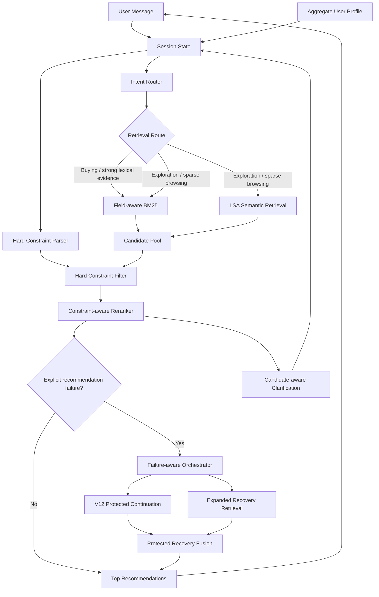
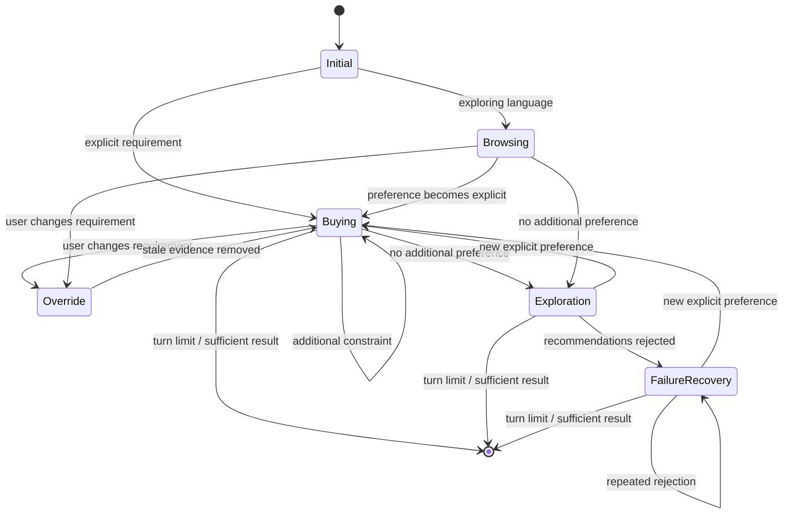
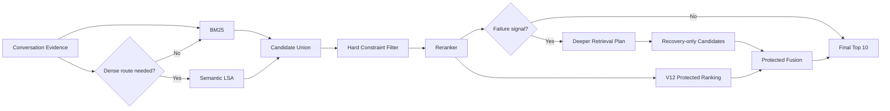
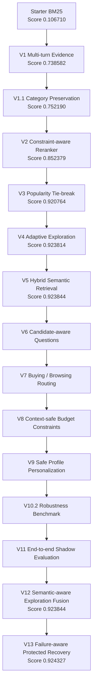
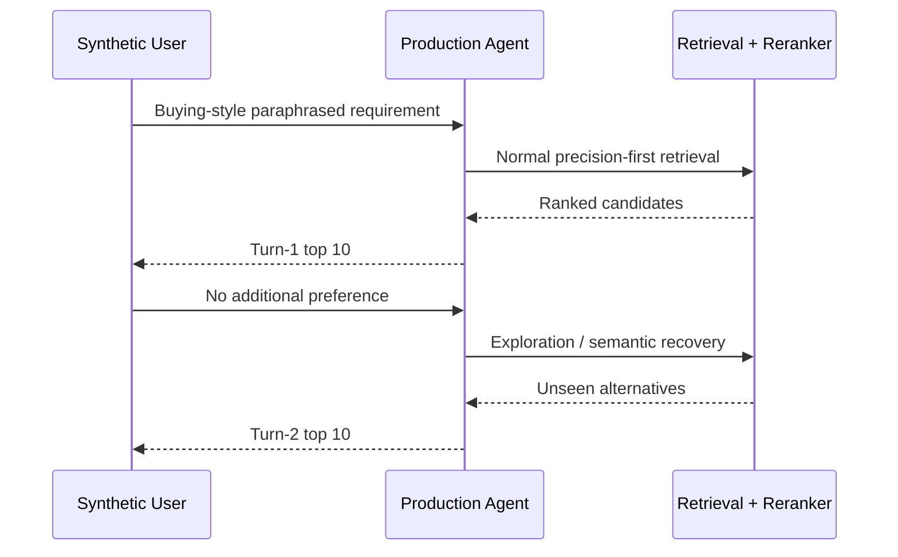

# TechJam 2026 — Conversational Shopping Copilot

AI-powered conversational product search and recommendation system for **TechJam 2026 Problem Statement 4: Shopping Copilot — AI Conversational Search and Recommendations**.

The system operates over the frozen **50,000-product Amazon Reviews 2023 Clothing, Shoes & Jewelry catalogue** and maintains conversational state across a maximum of 10 user turns.

Our approach combines:

- field-aware BM25 lexical retrieval;
- lightweight catalogue-trained semantic retrieval;
- deterministic candidate reranking;
- multi-turn preference accumulation;
- buying/browsing intent routing;
- intent override handling;
- candidate-aware clarification;
- adaptive long-tail exploration;
- hard budget constraints;
- safe aggregate-profile personalization;
- semantic-aware exploration fusion;
- failure-aware runtime orchestration;
- protected deep-retrieval recovery;
- catalogue-derived robustness evaluation.

The original participant-kit README is preserved at:

`docs/participant-kit/ORIGINAL_README.md`

Dataset attribution is documented at:

`DATA_ATTRIBUTION.md`

---

# Current Performance

Latest official **200-session public evaluator** result:

| Metric | Score |
|---|---:|
| Hit Rate@10 | **1.0000** |
| MRR | **0.817089** |
| MTTC | **2.040** |
| Efficiency | **0.8960** |
| Technical Score | **0.924327** |

Official starter baseline:

| Metric | Baseline |
|---|---:|
| Hit Rate@10 | 0.125 |
| MRR | 0.068034 |
| MTTC | 9.81 |
| Efficiency | 0.119 |
| Technical Score | 0.10671 |

The current agent reaches all **200 / 200 public targets** while substantially improving ranking quality and recommendation speed relative to the starter implementation.

The public evaluator is not used as the sole development signal. Because 800 evaluation sessions remain private, production changes are also tested against catalogue-derived, label-free shadow benchmarks intended to reduce public-set overfitting.

---

# Architecture



The architecture deliberately remains **lexical-first**.

Catalogue-derived robustness testing showed that BM25 remains substantially stronger as a standalone retriever. Semantic retrieval therefore acts as a complementary recovery mechanism rather than replacing the lexical route.

After explicit recommendation failures, V13 can dynamically increase retrieval depth. The deeper route cannot freely replace the proven ranking path: almost the entire existing recommendation set is protected, while only a bounded number of slots are available to genuinely new recovery candidates.

---

# Conversational Flow



---

# Retrieval Strategy



Dense retrieval is **not enabled universally**.

Previous ablations showed that always-on semantic retrieval reduced public MRR. The semantic route is therefore activated as a targeted recovery mechanism during exploration or when browsing retrieval is sparse.

---

# Runtime Retrieval Plans

The production system adapts candidate depth according to the conversational state.

## Precision Path

Used before clarification exhaustion:

```text
Lexical Top 100
```

Semantic retrieval is normally disabled for high-confidence buying requests.

---

## V12 Exploration Path

Used once broad clarification is exhausted:

```text
Lexical Top 500
+
Semantic Top 250
```

---

## V13 Failure Recovery

After explicit recommendation rejection, the search budget expands.

### Failure Level 1

```text
Lexical Top 875
+
Semantic Top 438
```

### Failure Level 2

```text
Lexical Top 1250
+
Semantic Top 625
```

Failure depth is capped at level 2 to avoid unconstrained runtime and memory growth.

For a 10-product recommendation set, V13 uses protected recovery:

```text
9 V12 continuation candidates
+
1 candidate found only by deeper recovery
```

The recovery candidate must be absent from the complete V12 candidate pool. This prevents deeper search from simply reshuffling products that were already available to the baseline path.

---

# Implementation Evolution



---

# Version History

## V1 — Conversational State

The starter agent was stateless and searched only the latest customer message.

V1 introduced accumulated conversational evidence so later turns benefited from earlier preferences.

Public score:

```text
0.106710 → 0.738582
```

---

## V1.1 — Category Preservation

Separated persistent product-category information from mutable user preferences.

This was important for intent override scenarios: when the user changes a preference, stale preference evidence can be removed without accidentally deleting the product category.

Public score:

```text
0.738582 → 0.752190
```

---

## V2 — Constraint-aware Reranking

Added a deterministic reranker over the BM25 candidate pool.

Signals include:

- category token coverage;
- exact category phrase matches;
- accumulated evidence coverage;
- exact evidence phrases;
- BM25 ranking.

Public score:

```text
0.752190 → 0.852379
```

---

## V3 — Popularity Tie-breaking

Many catalogue products can have effectively identical textual relevance.

V3 uses `rating_number` as a deterministic secondary signal inside equal relevance tiers.

Public result:

| Metric | Result |
|---|---:|
| Hit Rate@10 | 0.995 |
| MRR | 0.811881 |
| Technical Score | 0.920764 |

---

## V4 — Adaptive Exploration

One public target was a highly ambiguous long-tail product that could not be distinguished from many lexical matches.

V4 introduced:

- clarification exhaustion detection;
- wider candidate retrieval after the user has no more information;
- long-tail exploration ordering;
- seen-product filtering.

Public result:

| Metric | Result |
|---|---:|
| Hit Rate@10 | **1.000** |
| Technical Score | 0.923814 |

---

## V5 — Hybrid Semantic Retrieval

Added a local semantic retrieval path trained entirely on the provided 50k catalogue.

Implementation:

- TF-IDF;
- 1–2 gram features;
- Truncated SVD;
- 96-dimensional LSA representation;
- normalized document embeddings;
- `float16` catalogue matrix.

Semantic search is used adaptively rather than universally because always-on dense retrieval reduced public MRR.

Current semantic assets:

- `assets/catalog_lsa.npy`
- `assets/semantic_asins.json`
- `assets/semantic_pipeline.joblib`

Public TechnicalScore reached:

```text
0.923844
```

---

## V6 — Candidate-aware Clarification

The first three turns retain broad `other` clarification because this aligns well with the deterministic competition simulator.

For unresolved later turns, clarification is selected using candidate uncertainty.

Possible dimensions include:

- material;
- color;
- size;
- style;
- use case;
- feature.

Questions are chosen using coverage and normalized entropy across the current candidate set.

---

## V7 — Intent Routing

Added explicit conversational intent state:

```text
BUYING
BROWSING
```

Browsing language can enable broader retrieval when the lexical pool is weak.

Explicit narrowing such as:

```text
I prefer
I would prefer
I'd like
I need
my budget
what matters most
```

moves the session into buying mode.

This preserved the public benchmark while making retrieval behavior more intentional.

---

## V8 — Hard Budget Constraints

Added structured price filtering.

Examples correctly understood:

```text
under $80
budget under 80
price below 100
I can spend up to 120
$50 to $100
```

The parser intentionally rejects unrelated measurements such as:

```text
fits up to 8-inch wrist circumference
water resistant up to 30m
```

This prevents arbitrary catalogue measurements from being interpreted as monetary constraints.

---

## V9 — Safe Profile Personalization

Uses anonymized aggregate profile tags to influence **which clarification dimension** may matter.

The profile never invents a concrete preference.

For example:

```text
material matters historically
```

does **not** imply:

```text
user wants cotton
```

Profile information is only allowed to break near-ties between candidate-driven clarification choices.

Priority:

```text
current explicit preference
        >
current candidate uncertainty
        >
aggregate historical profile
```

The profile does not directly change product retrieval or hard filtering.

---

# V10.2 — Catalogue-derived Robustness Benchmark

The public evaluator contains 200 labeled sessions, while 800 sessions remain private.

To reduce public-set overfitting, we added a self-supervised catalogue-derived robustness benchmark that does **not use public labels**.

The benchmark:

1. identifies explicit product concepts in catalogue metadata;
2. removes the original concept keyword from the query;
3. generates semantically equivalent paraphrases;
4. restricts concepts to sensible product domains;
5. treats every qualifying same-category product as relevant;
6. compares lexical and semantic candidate generation.

Examples:

```text
waterproof
→ something designed to keep water from getting through

breathable
→ something that helps reduce heat buildup during wear

non-slip
→ something with secure traction on slick surfaces
```

## V10.2 Results

130 cases balanced across 13 concept families:

| Retrieval Route | Hit@10 | Hit@100 | Macro Recall@100 |
|---|---:|---:|---:|
| Lexical | **58.46%** | **90.00%** | **67.78%** |
| Semantic | 16.15% | 59.23% | 18.86% |
| Hybrid candidate union | **60.00%** | **94.62%** | **73.43%** |

Complementarity:

```text
71 cases found by both routes
46 lexical-only cases
6 semantic rescue cases
7 missed by both
```

This supports the current design:

> Use lexical retrieval as the precision-first primary route and semantic retrieval as a complementary recovery mechanism.

---

# V11 — End-to-End Shadow Ranking

V10.2 measures whether relevant products enter the candidate pool.

V11 exercises the actual production interface:

```text
Agent.reset(...)
Agent.respond(...)
```

against the same catalogue-derived paraphrase benchmark and measures the final top-10 recommendations shown to the user.



## V11 Results

Across the 130 domain-gated shadow cases:

| Metric | Result |
|---|---:|
| Turn-1 Hit@10 | **77.69%** |
| Turn-1 MRR@10 | **0.4988** |
| New Turn-2 rescues | **14** |
| Cumulative hit by Turn 2 | **88.46%** |
| Rescue rate among initial misses | **48.28%** |
| Missed after both turns | **15 / 130** |

The production agent deliberately avoids repeating already-seen products during exploration. A Turn-1 hit therefore remains a successful session even when the product is not repeated on Turn 2.

V11 showed that exploration is valuable: almost half of first-turn misses were recovered by the second recommendation set.

However, of the six V10.2 cases in which semantic retrieval found a relevant product that lexical retrieval missed at depth 100, only one reached the final top 10.

This motivated V12.

---

# V12 — Semantic-Aware Exploration Fusion

V11 showed that semantic retrieval could recover products missed by lexical search, but many semantic-only candidates were not promoted into the final recommendation set.

V12 adds a bounded semantic reciprocal-rank signal during **exploration only**.

The normal precision path remains unchanged.

Semantic promotion is deliberately conservative:

- only semantic-only candidates receive the bonus;
- hybrid and lexical candidates receive no additional semantic boost;
- candidates must remain compatible with the active product category;
- semantic retrieval rank is used instead of raw cosine similarity;
- the feature activates only during exploration.

A label-free ablation tested semantic weights from `0.0` to `1.5`.

A weight of `1.0` was selected because it was the smallest value that improved session coverage while preserving ranking quality.

| Metric | V11 | V12 |
|---|---:|---:|
| Shadow Turn-1 Hit@10 | 77.69% | 77.69% |
| Shadow cumulative Hit@10 | 88.46% | **89.23%** |
| Turn-2 rescues | 14 | **15** |
| Remaining misses | 15 | **14** |
| Semantic-only rescues | 1 / 6 | **2 / 6** |
| Public Hit@10 | 1.000 | **1.000** |
| Public MRR | 0.815145 | **0.815145** |
| Public TechnicalScore | 0.923844 | **0.923844** |

The result supports semantic retrieval as a targeted recovery mechanism while keeping it subordinate to the stronger lexical relevance path.

---

# V13 — Failure-Aware Protected Recovery

V12 improved semantic candidate promotion, but residual analysis showed that some difficult sessions required substantially deeper candidate retrieval.

Simply increasing retrieval depth was not safe.

The first V13 ablation allowed the expanded candidate pool to replace the ordinary V12 exploration ranking.

Although this recovered new cases, it also lost a case that the existing V12 continuation would have found.

V13 therefore introduces **failure-aware protected recovery**.

The agent now observes explicit recommendation rejection as a runtime signal.

After a failed exploration turn, it can increase retrieval depth while retaining almost the entire proven V12 recommendation path.

The selected production configuration is:

```text
Failure-aware orchestration: enabled
Retrieval depth step:        0.75
Maximum failure level:       2
Protected recovery slots:    1
```

For a 10-product recommendation set:

```text
V12 ranks 1–9
+
highest-ranked genuinely new recovery candidate
```

A candidate only qualifies for the recovery slot when it is absent from the complete V12 candidate pool.

If deeper retrieval contributes nothing suitable, the slot falls back to the ordinary V12 continuation.

---

## Intent-Epoch Failure Memory

Recommendation failures are associated with the current shopping intent.

The state tracks:

```text
intent_epoch
miss_streak
failure_events
last_recommendations
failed_recommendations_by_epoch
```

When the customer explicitly overrides a previous requirement:

```text
old intent
    ↓
failure history

        OVERRIDE

new intent epoch
    ↓
miss streak reset
```

Historical failure information remains available for diagnostics, but does not contaminate the new intent.

---

## V13 Initial Expansion Ablation

A naive dynamic-depth version was compared with a Turn-5 V12 continuation control.

At depth step `0.75`:

```text
V12 continuation:
7 / 14 residual cases rescued

naive V13 expansion:
8 / 14 residual cases rescued
```

However, the unrestricted expansion:

```text
gained:
running
pockets

lost:
hiking
```

This showed that deeper retrieval contained useful new information but should not be allowed to replace the trusted V12 ranking wholesale.

That observation motivated protected recovery.

---

## V13 Protected Recovery Results

The evaluation begins with the 14 shadow cases still unresolved after V12 Turn 2.

The control continues the V12 agent through Turn 5 with the original retrieval depths.

| Metric | V12 Continuation | V13 Protected Recovery |
|---|---:|---:|
| Residual cases | 14 | 14 |
| Residual rescues | 7 | **9** |
| Residual rescue rate | 50.00% | **64.29%** |
| Cumulative shadow hits | 123 / 130 | **125 / 130** |
| Cumulative shadow Hit@10 | 94.62% | **96.15%** |
| Lost V12 rescues | — | **0** |
| Shadow first-hit MRR | **0.579154** | 0.575778 |
| Mean first-hit turn with miss=11 | 1.807692 | **1.692308** |
| Shadow efficiency analogue | 0.919231 | **0.930769** |
| Shadow TechnicalScore analogue | 0.830669 | **0.839657** |

The selected `0.75` depth step was preferable to `1.0`.

Both produced the same cumulative coverage, while `0.75` used less retrieval depth and slightly improved the shadow efficiency / TechnicalScore analogue.

---

## V13 Public Results

| Metric | V12 | V13 |
|---|---:|---:|
| Hit Rate@10 | **1.0000** | **1.0000** |
| MRR | 0.815145 | **0.817089** |
| MTTC | **2.035** | 2.040 |
| Efficiency | **0.8965** | 0.8960 |
| Technical Score | 0.923844 | **0.924327** |

Scenario-level comparison:

| Scenario | V13 Hit@10 | V13 MRR | V13 MTTC |
|---|---:|---:|---:|
| Boundary | 1.000 | 1.000000 | 2.6000 |
| Browsing | 1.000 | 0.768333 | 1.7750 |
| Buying | 1.000 | **0.813973** | 1.6375 |
| Intent Override | 1.000 | 0.894444 | 3.6333 |

The public improvement is intentionally modest because the benchmark was already saturated at 100% Hit@10.

The more important result is that the same architecture:

- improves the independent catalogue-derived robustness benchmark;
- preserves every V12 continuation rescue in the tested residual set;
- preserves perfect public Hit@10;
- improves public MRR and TechnicalScore.

V13 therefore demonstrates runtime workflow re-orchestration rather than applying a fixed retrieval strategy on every turn.

---

# Repository Structure

```text
.
├── assets/
│   ├── catalog_lsa.npy
│   ├── semantic_asins.json
│   └── semantic_pipeline.joblib
│
├── data/
│   ├── catalog.jsonl
│   └── public_set.jsonl
│
├── docs/
│   └── participant-kit/
│       └── ORIGINAL_README.md
│
├── evaluator/
│   └── local_evaluator.py
│
├── experiments/
│   ├── v8_hard_constraints.json
│   ├── v8_1_money_safe_constraints.json
│   ├── v9_safe_personalization.json
│   ├── v10_2_concept_smoke.json
│   ├── v10_2_concept_robustness.json
│   ├── v11_end_to_end_shadow.json
│   ├── v11_1_end_to_end_shadow.json
│   ├── v12_fusion_smoke.json
│   ├── v12_fusion_ablation.json
│   ├── v12_end_to_end_shadow.json
│   ├── v12_semantic_exploration_fusion.json
│   ├── v13a_disabled_public_check.json
│   ├── v13_failure_orchestration_smoke.json
│   ├── v13_failure_orchestration.json
│   ├── v13_protected_recovery_smoke.json
│   ├── v13_protected_recovery.json
│   └── v13_public_eval.json
│
├── scripts/
│   ├── build_semantic_index.py
│   ├── concept_robustness_eval.py
│   ├── end_to_end_shadow_eval.py
│   ├── v12_fusion_ablation.py
│   ├── v13_failure_orchestration_eval.py
│   └── v13_protected_recovery_eval.py
│
├── src/
│   ├── dialogue.py
│   ├── fusion.py
│   ├── hard_constraints.py
│   ├── intent.py
│   ├── orchestration.py
│   ├── profile.py
│   ├── questions.py
│   ├── reranker.py
│   ├── retrieval.py
│   ├── semantic.py
│   └── state.py
│
├── starter/
│   └── agent.py
│
├── tests/
│
├── DATA_ATTRIBUTION.md
├── requirements.txt
└── README.md
```

---

# Setup

Python 3.10+ is recommended.

Create the environment:

```powershell
python -m venv .venv
.\.venv\Scripts\Activate.ps1
```

Install dependencies:

```powershell
pip install -r requirements.txt
```

Run the full automated test suite:

```powershell
python -m unittest -v
```

Current production suite:

```text
105 tests
```

---

# Reproducing the Current Results

## Official Public Evaluation

Run:

```powershell
python -m evaluator.local_evaluator --output experiments\v13_public_eval.json
```

Expected:

```text
sample_count                 200
hit_rate_at_10               1.0
mrr                          0.817089
mttc                         2.04
efficiency                   0.896
recommended_technical_score  0.924327
```

---

## Catalogue-derived Retrieval Robustness

Run:

```powershell
python -m scripts.concept_robustness_eval --cases 130 --output experiments\v10_2_concept_robustness.json
```

---

## End-to-End Shadow Evaluation

Run:

```powershell
python -m scripts.end_to_end_shadow_eval --output experiments\v12_end_to_end_shadow.json
```

---

## V12 Semantic Fusion Ablation

Run:

```powershell
python -m scripts.v12_fusion_ablation --output experiments\v12_fusion_ablation.json
```

---

## V13 Failure-Orchestration Ablation

Run:

```powershell
python -m scripts.v13_failure_orchestration_eval --steps "0,0.25,0.5,0.75,1.0" --max-turn 5 --output experiments\v13_failure_orchestration.json
```

---

## V13 Protected-Recovery Ablation

Run:

```powershell
python -m scripts.v13_protected_recovery_eval --steps "0,0.25,0.5,0.75,1.0" --recovery-slots 1 --max-turn 5 --output experiments\v13_protected_recovery.json
```

Selected production configuration:

```text
depth_step      = 0.75
recovery_slots  = 1
```

---

# Evaluation Discipline

The official public evaluator is useful but contains only 200 labeled sessions.

The final evaluation contains an additional 800 private sessions with different users and target products.

For that reason, this project uses three evaluation layers:

```text
Unit / regression tests
        ↓
Catalogue-derived label-free shadow evaluation
        ↓
Official public evaluator
```

A feature is not accepted merely because it improves the public score.

Where possible, the feature must first have a plausible architectural justification and demonstrate improvement on an independently constructed evaluation.

---

# Design Principles

## Precision Before Breadth

Dense retrieval is not automatically better than lexical search.

The system keeps BM25 as its primary high-precision retrieval route.

---

## Semantic Retrieval as Recovery

Semantic search is activated when there is evidence that lexical retrieval may be insufficient.

It expands candidate recall without replacing the lexical precision path universally.

---

## Current Session Intent Wins

Explicit current requirements always outrank historical profile information.

---

## No Fabricated Preferences

Aggregate profile tags can influence clarification strategy, but never create product preferences that the user did not express.

---

## Hard Constraints Must Be Safe

Structured hard filtering is used only when the constraint can be extracted reliably.

The budget parser therefore requires monetary context and rejects unrelated numbers or measurements.

---

## Protect Proven Behaviour

A broader retrieval strategy should not automatically replace a narrower strategy that already works well.

V13 demonstrates this principle by retaining nine V12 recommendations and reserving only one slot for a deeper recovery candidate.

---

## Failure Is Information

Explicit rejection of a recommendation set is treated as a runtime signal.

Instead of repeating the same workflow indefinitely, the agent can increase search breadth after failure.

---

## Bounded Adaptation

Adaptive search is capped.

The system avoids unlimited candidate expansion, uncontrolled compute growth, and unbounded semantic retrieval.

---

## Deterministic and Reproducible

The current production pipeline does not require an external paid LLM API.

This minimizes:

- external dependencies;
- token cost;
- nondeterminism;
- credential requirements;
- network dependence.

---

## Public-set Restraint

Production changes are not accepted solely because they improve the 200 public sessions.

Catalogue-derived shadow tests provide an additional evaluation axis for private-set robustness.

---

# Competition Constraints

Key constraints from the participant kit:

- frozen 50,000-product catalogue;
- maximum 10 turns per session;
- exact `parent_asin` recommendation matching;
- 200 labeled public sessions;
- 800 private evaluation sessions;
- public and private sessions use different users and targets;
- catalogue is read-only;
- participant-visible metadata only;
- no modification of evaluator logic;
- no modification of public labels or target ASINs;
- text and structured metadata only;
- lightweight in-memory execution expected.

---

# Limitations

Despite the strong public score, the system still has several limitations.

## Structured State Is Incomplete

Most conversational preferences are currently stored as accumulated free text.

Budget is explicitly structured, but dimensions such as:

```text
material
color
size
style
brand
feature
use case
```

are not yet represented as first-class state objects.

This limits precise slot rewriting and context distillation.

---

## Semantic Retrieval Is Lightweight

The semantic route uses catalogue-trained TF-IDF + LSA.

This is inexpensive, deterministic and fully local, but less expressive than a modern neural semantic encoder or cross-encoder.

---

## The Reranker Is Primarily Deterministic

The current reranker combines lexical evidence, constraint coverage, catalogue popularity and bounded semantic retrieval information.

It does not yet contain a learned semantic cross-encoder or generative LLM ranking stage.

---

## Early Clarification Is Simulator-aware

Broad `other` clarification performs well with the deterministic evaluator.

A real commercial shopping assistant would likely want a more natural expected-information-gain policy from the first ambiguous turn.

---

## Product Taxonomy Is Mostly Flattened

Category information is used heavily for lexical scoring and safety, but the agent does not yet maintain an explicit hierarchical product taxonomy for structured cross-category browsing.

---

## Deep Recovery Costs More

V13 intentionally performs additional retrieval only after explicit failures.

This improves difficult-session coverage but increases runtime on those later recovery turns.

The expansion is capped to control this trade-off.

---

## Shadow Relevance Is Imperfect

The catalogue-derived robustness benchmark treats matching same-category products as relevant.

This avoids using public labels, but is only a proxy for real shopper relevance.

Some semantically reasonable cross-category recommendations may therefore be counted as negatives.

---

# Future Improvements

The highest-priority future directions are:

1. structured conversational slots and lifecycle management;
2. selective slot rewriting during intent override;
3. confidence-aware context distillation and safe slot decay;
4. local semantic reranking on small candidate sets;
5. catalogue-grounded query rewriting;
6. explicit product-category hierarchy for browsing;
7. richer recommendation explanations;
8. runtime latency and memory profiling.

Any future production change must continue to pass:

```text
automated regression tests
+
label-free robustness evaluation
+
official public evaluator
```

before it is considered for the final submission.

---

# Team Workflow

`main` is treated as the stable shared team baseline.

Experimental development occurs on separate branches so teammates can continue working from a known-good version without being affected by unfinished experiments.

Current development model:

```text
main
│
└── stable shared baseline
     currently includes V12

harshil/dev
│
├── V13 failure-aware protected recovery
├── future experimental versions
└── candidate final integration
```

Near the end of development, proven changes can be reviewed and merged into `main`.

For every production change:

```text
implement
    ↓
unit tests
    ↓
shadow evaluation
    ↓
public regression gate
    ↓
commit to development branch
    ↓
final review before main
```

---

# Git Safety

Do not modify:

- evaluator logic;
- public labels;
- official target ASINs;
- catalogue contents.

Do not commit:

```text
.venv/
.vscode/
```

Experimental outputs should be clearly named by version so results remain reproducible.

---

# Protected Public Benchmark

The current V13 production benchmark is:

```text
Hit Rate@10      1.000000
MRR              0.817089
MTTC             2.040
Efficiency       0.8960
Technical Score  0.924327
```

The previous V12 benchmark was:

```text
Hit Rate@10      1.000000
MRR              0.815145
MTTC             2.035
Efficiency       0.8965
Technical Score  0.923844
```

A production change that reduces Hit Rate@10 should normally be rejected unless there is compelling independent evidence of substantially better private-set generalization.

---

# Team Contributions

> Complete the remaining names and contribution descriptions before the final Devpost submission.

| Team Member | Contribution |
|---|---|
| Harshil | Conversational state, retrieval/reranking experimentation, semantic-recovery evaluation, failure-aware orchestration, robustness testing and technical documentation |
| Team Member 2 | TODO |
| Team Member 3 | TODO |
| Team Member 4 | TODO |

---

# Current Status

Completed through production V13:

- multi-turn conversational memory;
- category preservation;
- intent override handling;
- field-aware lexical retrieval;
- constraint-aware reranking;
- popularity tie-breaking;
- adaptive long-tail exploration;
- local semantic retrieval;
- buying/browsing intent routing;
- candidate-aware clarification;
- context-safe budget filtering;
- safe aggregate-profile personalization;
- catalogue-derived semantic robustness benchmark;
- end-to-end shadow ranking benchmark;
- semantic-aware exploration fusion;
- failure detection;
- intent-epoch failure memory;
- adaptive retrieval-depth escalation;
- protected deep-retrieval recovery.

Current public result:

```text
HR@10            1.000000
MRR              0.817089
Technical Score  0.924327
```

Current label-free robustness result:

```text
V12 continuation through Turn 5:
123 / 130 cumulative hits
94.62%

V13 protected recovery:
125 / 130 cumulative hits
96.15%
```

Next development target:

> **Structured conversational context: first-class slots, selective override rewriting, confidence-aware context distillation, and safe slot lifecycle management.**