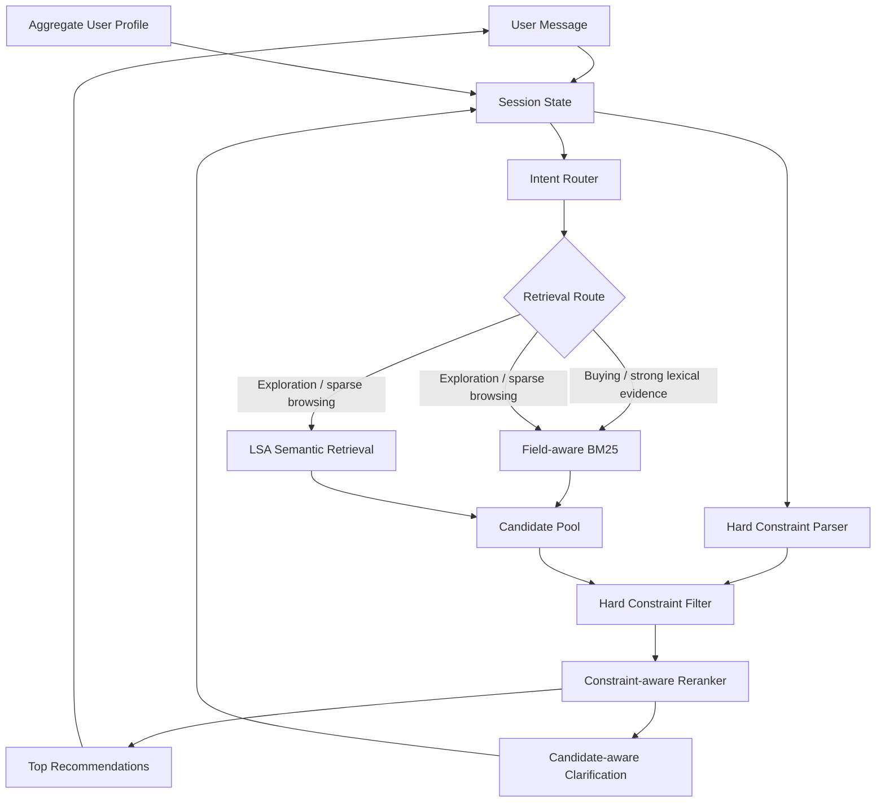
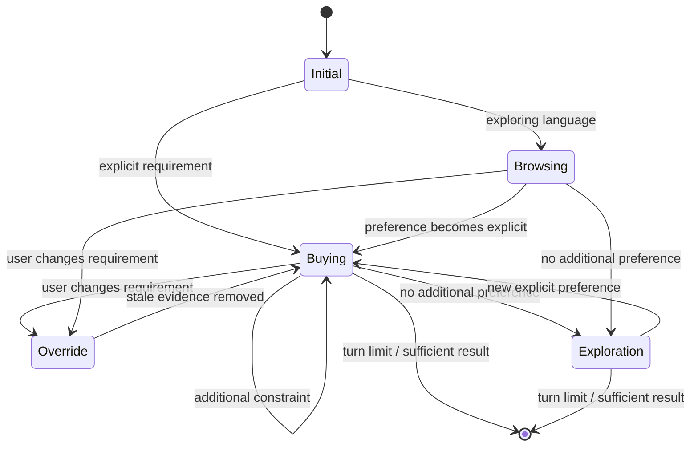
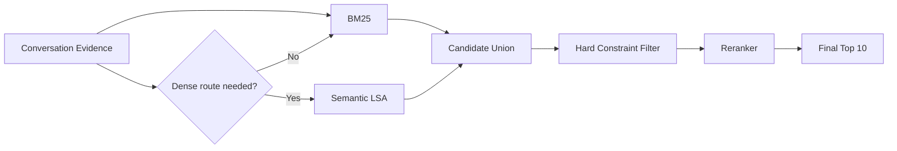
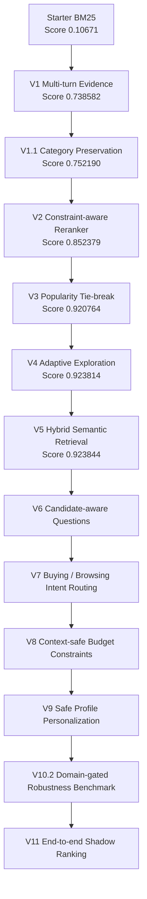
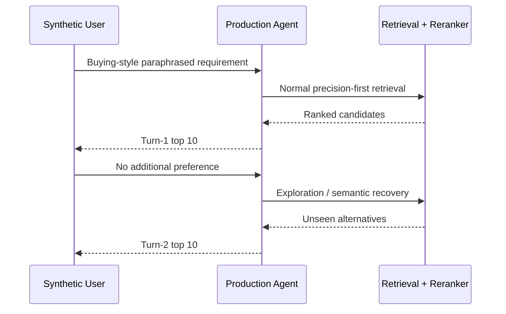

# TechJam 2026 — Conversational Shopping Copilot

AI-powered conversational product search and recommendation system for **TechJam 2026 Problem Statement 4: Shopping Copilot — AI Conversational Search and Recommendations**.

The system operates over the frozen **50,000-product Amazon Reviews 2023 Clothing, Shoes & Jewelry catalogue** and maintains conversational state across a maximum of 10 user turns.

Our approach combines:

- field-aware BM25 lexical retrieval;
- lightweight catalogue-trained semantic retrieval;
- deterministic candidate reranking;
- multi-turn preference accumulation;
- intent and override handling;
- candidate-aware clarification;
- adaptive long-tail exploration;
- hard budget constraints;
- safe aggregate-profile personalization;
- catalogue-derived robustness evaluation.

The original participant-kit README is preserved at:

`docs/participant-kit/ORIGINAL_README.md`

---

## Current Performance

Latest official **200-session public evaluator** result:

| Metric | Score |
|---|---:|
| Hit Rate@10 | **1.0000** |
| MRR | **0.815145** |
| MTTC | **2.035** |
| Efficiency | **0.8965** |
| Technical Score | **0.923844** |

Official starter baseline:

| Metric | Baseline |
|---|---:|
| Hit Rate@10 | 0.125 |
| MRR | 0.068034 |
| MTTC | 9.81 |
| Efficiency | 0.119 |
| Technical Score | 0.10671 |

The current agent therefore reaches all 200 public targets while substantially improving ranking quality and recommendation speed relative to the starter implementation.

---

# Architecture



The primary architecture deliberately remains **lexical-first**.

Catalogue-derived robustness testing showed that BM25 remains substantially stronger as a standalone retriever, while semantic retrieval provides complementary recovery on queries with weaker lexical overlap.

---

# Conversational Flow



---

# Retrieval Strategy



Dense retrieval is **not enabled universally**.

Previous ablations showed that always-on semantic retrieval reduced public MRR. The semantic route is therefore used as a recovery mechanism during exploration or when browsing retrieval is sparse.

---

# Implementation Evolution



---

# Version History

## V1 — Conversational State

The starter agent was stateless and searched only the latest customer message.

V1 introduced accumulated conversational evidence so later turns benefited from earlier preferences.

Public score:

`0.106710 → 0.738582`

---

## V1.1 — Category Preservation

Separated persistent product-category information from mutable user preferences.

This was important for intent override scenarios: when the user changes a preference, stale preference evidence can be removed without accidentally deleting the product category.

Public score:

`0.738582 → 0.752190`

---

## V2 — Constraint-aware Reranking

Added a deterministic reranker over the BM25 candidate pool.

Signals include:

- category token coverage;
- exact category phrase matches;
- accumulated evidence coverage;
- exact evidence phrases;
- BM25 ranking.

Public score:

`0.752190 → 0.852379`

---

## V3 — Popularity Tie-breaking

Many catalogue products can have effectively identical textual relevance.

V3 uses `rating_number` as a deterministic secondary signal inside equal relevance tiers.

Public result:

- Hit Rate@10: `0.995`
- MRR: `0.811881`
- Technical Score: `0.920764`

---

## V4 — Adaptive Exploration

One public target was a highly ambiguous long-tail product that could not be distinguished from many lexical matches.

V4 introduced:

- clarification exhaustion detection;
- wider candidate retrieval after the user has no more information;
- long-tail exploration ordering;
- seen-product filtering.

Public result:

- Hit Rate@10: **1.000**
- Technical Score: `0.923814`

---

## V5 — Hybrid Semantic Retrieval

Added a local semantic retrieval path trained entirely on the provided 50k catalogue.

Implementation:

- TF-IDF;
- 1–2 gram features;
- Truncated SVD;
- 96-dimensional LSA representation;
- normalized document embeddings;
- `float16` catalogue matrix.

Semantic search is used adaptively rather than universally because always-on dense retrieval reduced public MRR.

Current semantic assets:

- `assets/catalog_lsa.npy`
- `assets/semantic_asins.json`
- `assets/semantic_pipeline.joblib`

Public score reached:

**0.923844**

---

## V6 — Candidate-aware Clarification

The first three turns retain broad `other` clarification because this aligns well with the deterministic competition simulator.

For unresolved later turns, clarification is selected using candidate uncertainty.

Possible dimensions include:

- material;
- color;
- size;
- style;
- use case;
- feature.

Questions are chosen using coverage and normalized entropy across the current candidate set.

---

## V7 — Intent Routing

Added explicit conversational intent state:

- `BUYING`
- `BROWSING`

Browsing language can enable broader retrieval when the lexical pool is weak.

Explicit narrowing such as:

- `I prefer`
- `I would prefer`
- `I'd like`
- `I need`
- `my budget`
- `what matters most`

moves the session into buying mode.

This preserved the public benchmark while making retrieval behavior more intentional.

---

## V8 — Hard Budget Constraints

Added structured price filtering.

Examples correctly understood:

- `under $80`
- `budget under 80`
- `price below 100`
- `I can spend up to 120`
- `$50 to $100`

The parser intentionally rejects unrelated measurements such as:

- `fits up to 8-inch wrist circumference`
- `water resistant up to 30m`

This avoids interpreting arbitrary catalogue measurements as budget constraints.

---

## V9 — Safe Profile Personalization

Uses anonymized aggregate profile tags to influence **which clarification dimension** may matter.

The profile never invents a concrete preference.

For example:

`material matters historically`

does **not** imply:

`user wants cotton`

Profile information is only allowed to break near-ties between candidate-driven clarification choices.

Priority:

1. current explicit preference;
2. current candidate uncertainty;
3. aggregate historical profile.

---

# V10.2 — Robustness Benchmark

The public evaluator contains 200 labeled sessions, while 800 sessions remain private.

To reduce public-set overfitting, we added a self-supervised catalogue-derived robustness benchmark that does **not use public labels**.

The benchmark:

1. identifies explicit product concepts in catalogue metadata;
2. removes the original concept keyword from the query;
3. generates semantically equivalent paraphrases;
4. restricts concepts to sensible product domains;
5. treats every qualifying same-category product as relevant;
6. compares lexical and semantic candidate generation.

Examples:

`waterproof`

→ `something designed to keep water from getting through`

`breathable`

→ `something that helps reduce heat buildup during wear`

`non-slip`

→ `something with secure traction on slick surfaces`

## V10.2 Results

130 cases, balanced across 13 concept families:

| Retrieval route | Hit@10 | Hit@100 | Macro Recall@100 |
|---|---:|---:|---:|
| Lexical | **58.46%** | **90.00%** | **67.78%** |
| Semantic | 16.15% | 59.23% | 18.86% |
| Hybrid candidate union | **60.00%** | **94.62%** | **73.43%** |

Complementarity:

- 71 cases found by both routes;
- 46 lexical-only cases;
- 6 semantic rescue cases;
- 7 missed by both.

This supports the current design:

> Use lexical retrieval as the precision-first primary route and semantic retrieval as a complementary recovery mechanism.

---

# V11 — End-to-End Shadow Ranking

V10.2 measures whether relevant products enter the candidate pool.

V11 exercises the actual production interface:

```text
Agent.reset(...)
Agent.respond(...)
```

against the same catalogue-derived paraphrase benchmark and measures the final top-10 recommendations shown to the user.



## V11 Results

Across the 130 domain-gated shadow cases:

| Metric | Result |
|---|---:|
| Turn-1 Hit@10 | **77.69%** |
| Turn-1 MRR@10 | **0.4988** |
| New turn-2 rescues | **14** |
| Cumulative hit by turn 2 | **88.46%** |
| Rescue rate among initial misses | **48.28%** |
| Missed after both turns | **15 / 130** |

The production agent deliberately avoids repeating already-seen products during exploration. Therefore a turn-1 hit remains a successful session even when the target is not repeated on turn 2.

V11 shows that exploration is valuable: almost half of the cases that missed on the first recommendation set were recovered by the second.

However, semantic promotion remains an opportunity. Of the six V10.2 cases in which semantic retrieval found a relevant product that lexical retrieval completely missed at depth 100, only one was promoted into the final top 10 during exploration.

This motivates the next experiment:

> Improve semantic candidate fusion during exploration without changing the protected turn-1 lexical ranking path.

## V12 — Semantic-Aware Exploration Fusion

V11 showed that semantic retrieval could recover products missed by lexical search, but many semantic-only candidates were not promoted into the final recommendation set.

V12 adds a bounded semantic reciprocal-rank signal during **exploration only**. The normal buying path remains unchanged.

Semantic promotion is deliberately conservative:

- only semantic-only candidates receive the bonus;
- hybrid/lexical candidates receive no additional semantic boost;
- candidates must remain compatible with the active product category;
- semantic retrieval rank is used instead of raw cosine similarity;
- the feature activates only during exploration.

A label-free ablation tested weights from `0.0` to `1.5`. A weight of `1.0` was selected because it was the smallest value that improved session coverage while preserving ranking quality.

| Metric | V11 | V12 |
|---|---:|---:|
| Shadow Turn-1 Hit@10 | 77.69% | 77.69% |
| Shadow cumulative Hit@10 | 88.46% | **89.23%** |
| Turn-2 rescues | 14 | **15** |
| Remaining misses | 15 | **14** |
| Semantic-only rescues | 1 / 6 | **2 / 6** |
| Public Hit@10 | 1.000 | **1.000** |
| Public MRR | 0.815145 | **0.815145** |
| Public TechnicalScore | 0.923844 | **0.923844** |

The result suggests semantic retrieval is useful as a targeted recovery mechanism, but should remain subordinate to the stronger lexical relevance path.

---

# V13 — Hard Constraint Parser Generalization Hardening

`data/public_set.jsonl` contains no free-text customer messages at all -- every budget phrase the parser was ever validated against locally is synthesized by `evaluator/local_evaluator.py`'s own template functions. A code and data audit found that the parser and its session-state coupling had, in places, been tuned to that same narrow template distribution rather than to budget language in general:

- the intent-override detector was a hardcoded exact match on two substrings (`"actually"` and `"ignore my earlier preference"`), character-for-character the evaluator's own override sentence;
- negated bounds such as `not over $100` were parsed as the opposite positive constraint (`min_price=100`);
- there was no way to explicitly cancel a budget (`"actually, no budget limit"` was a silent no-op);
- the bound vocabulary was closed -- any phrasing outside ~15 templates silently dropped the constraint.

None of this showed up in the public benchmark, because the public benchmark only exercises the same template phrasings the code was tuned against. V13 fixes the four gaps above with small, additive changes to `src/hard_constraints.py` and `src/state.py` -- no restructuring of the existing money-context → approximate-language → range/bound staged pipeline, and no new hard-filter attribute types (brand/size/color/etc. remain soft reranking signals by design).

Examples now handled correctly:

- `Not above $50, please.` / `Not under $80.` → no longer misparsed as an inverted bound.
- `Actually, no budget limit anymore.` → clears an existing budget instead of leaving it stale.
- `On second thought, forget my earlier preference -- here's what I actually need: waterproof shoes.` → triggers the override despite not matching the evaluator's literal sentence.
- `Show me something cheaper than $60.` / `I'm capped at $90.` → new generic vocabulary.
- `Budget: $.75` → bare-decimal amounts now parse.

A new held-out parser eval suite (`scripts/budget_constraint_eval.py`), phrased independently of the evaluator's templates, was built first and used to measure the change:

| Metric | Before | After |
|---|---:|---:|
| Suite pass rate | 60% (15/25) | **96% (24/25)** |
| Detection precision | 0.625 | **0.909** |
| Detection recall | 0.5 | **1.000** |
| Detection F1 | 0.556 | **0.952** |
| Negation accuracy | 0.0 | **1.000** |
| Numeric accuracy | 0.6 | **1.000** |
| Multi-turn state accuracy | 0.667 | **1.000** |
| Public Hit@10 | 1.000 | **1.000** |
| Public MRR | 0.815145 | **0.815145** |
| Public TechnicalScore | 0.923844 | **0.923844** |

The public benchmark is byte-identical before and after -- every change is additive (a new guard, a new sentinel, new vocabulary) rather than a modification to any currently-matching pattern, so nothing that previously passed can regress.

Known, documented limitations not addressed in this pass:

- negation handling is adjacency-based only -- semantically displaced negation such as `I don't want to spend more than $90` is not detected;
- the money-context gate scans the whole message rather than text near the numeric match, so an unrelated money-context word can still license an unrelated `up to N` phrase (e.g. `The cost is unclear, but it holds up to 10 items.`) -- tracked in the eval suite's `ACCEPTED_LIMITATIONS` rather than silently unmeasured.

---

# V14 — Ranking Generalization Improvements

The public 200-session benchmark is already saturated (Hit@10 = 1.000, MRR = 0.815145, unchanged since V10). Any further improvement can only be evidenced through the catalogue-derived robustness benchmarks (concept robustness, shadow eval), so V14's three changes were measured entirely against those, then confirmed not to move the public benchmark at all.

## V14.1 — Domain-Synonym Query Expansion

Water/moisture-resistance concepts (`waterproof`, `water_resistant`) were the single largest concentrated cluster of residual shadow-eval failures -- 6 of 14 `miss_both` cases (43%), unchanged across V11 and V12 despite ranking tuning in between. The underlying cause was retrieval, not ranking: a paraphrase like *"something suitable for occasional wet conditions"* shares no words with catalogue listing text like *"Water-Resistant"*, so the right product was often never retrieved as a candidate at all -- no amount of reranking can promote a candidate that was never found.

Added `src/query_expansion.py`: a small, generic, extensible synonym-group mechanism that appends canonical catalogue-style terms (`waterproof`, `water resistant`, `weatherproof`, ...) to retrieval query text whenever a short domain trigger phrase is present. Purely additive -- the original text is never altered or removed -- and wired into both retrieval routes (BM25 evidence terms, and the semantic route's query text) so neither route is left behind. Trigger phrases are short generic fragments, not copied verbatim from any benchmark case, so the expansion targets the concept rather than the benchmark's exact wording.

| Metric | Before | After |
|---|---:|---:|
| Lexical Hit@10 | 58.5% | **60.0%** |
| Hybrid Hit@10 | 60.0% | **61.5%** |
| Hybrid Hit@100 | 94.6% | **95.4%** |
| Concept-robustness cases missed by both routes | 7 | **6** |
| Shadow-eval `miss_both` | 14 | **12** |

## V14.2 — Relevance-Scaled Semantic Exploration Bonus

V12's own ablation showed the semantic-only exploration bonus plateaus completely at weight ≥ 1.0: larger weights changed nothing, which was evidence the fixed 0-1 bonus was simply too small to compete with deterministic relevance scores that can run into double digits, not that the weight itself was well-tuned. Even at maximum weight, only 2 of 6 V10.2 semantic-rescue cases were ever promoted into the exploration top-10.

`semantic_exploration_bonus()` now multiplies the bounded rank signal by the current query's own relevance range (`relevance_scale`, default `1.0` reproduces the exact V12 formula) instead of a fixed constant. Re-running the same label-free 130-case ablation methodology (`scripts/v14_relevance_scaled_fusion_ablation.py`) against the new formula shape produced a genuinely useful, if humbling, result:

| Weight | Cumulative Hit@10 | Rescues | Misses | Semantic-only rescued |
|---:|---:|---:|---:|---:|
| 0.0 | 90.00% | 15 | 13 | 1 |
| **0.25** | **90.77%** | **16** | **12** | **2** |
| 0.5 | 90.77% | 16 | 12 | 2 |
| 0.75 | 84.62% | 8 | 20 | 2 |
| 1.0 (old default) | 80.00% | 2 | 26 | 0 |

The old weight of `1.0` is now *too strong* under the rescaled formula and actively regresses cumulative Hit@10. `0.25` is the smallest tested value reaching the sweep's best result -- but that best result exactly ties the old fixed formula's own best setting on every primary metric. Stated plainly: this redesign does not unlock further improvement on this benchmark. What it does provide is a properly calibrated weight range (a fixed constant no longer has to be tuned against an unknown, query-dependent relevance scale), which is why it was still adopted (`SEMANTIC_EXPLORATION_WEIGHT = 0.25`) rather than reverted.

## V14.3 — Average Rating as a Last-Resort Exploration Tie-Break

`average_rating` is present in the catalogue for every product but was used nowhere in the pipeline -- not in retrieval, not in reranking, not in the semantic embedding (that last exclusion is intentional and unchanged: the semantic model describes what a product *is*, not how good it is). As a ranking signal it was simply unused, free information.

`starter/agent.py` now precomputes `average_rating` per product exactly like the existing `price` attachment. `rerank_for_exploration` appends it (descending, missing treated as lowest) as a 5th and final tie-break key, after the existing long-tail `rating_number` key -- so it only activates when fusion score, relevance, `rating_number`, and retrieval depth are already fully tied. `rerank_candidates` (the buying path) is deliberately untouched, respecting its own `"V12 deliberately does NOT modify this path"` docstring. As expected for a narrow last-resort tie-break, this showed no measurable movement on the 130-case shadow benchmark -- it is a low-risk, evidence-honest addition rather than a proven win.

## V14 Summary

| Metric | Before (V12) | After (V14) |
|---|---:|---:|
| Shadow cumulative Hit@10 | 89.23% | **90.77%** |
| Turn-2 rescues | 15 | **16** |
| Remaining misses | 14 | **12** |
| Concept-robustness hybrid Hit@10 | 60.0% | **61.5%** |
| Public Hit@10 | 1.000 | **1.000** |
| Public MRR | 0.815145 | **0.815145** |
| Public TechnicalScore | 0.923844 | **0.923844** |

Practically all of the measured movement traces to V14.1 (query expansion); V14.2 ties rather than beats the prior formula's own best setting, and V14.3 is a low-risk addition with no measured effect on this benchmark. The public benchmark is confirmed byte-identical throughout -- consistent with the "Public-set restraint" principle above, none of these changes were accepted on public-benchmark movement (there was none to have), only on the catalogue-derived robustness benchmarks.

---

# V15 — Scenario Efficiency Improvements

The official evaluator reports MRR and MTTC separately per scenario type (`boundary`, `browsing`, `buying`, `intent_override`). With Hit@10 already perfect everywhere, these per-scenario breakdowns are where remaining headroom actually shows up. Two of three original hypotheses for closing that headroom turned out to be wrong once traced through the actual code -- reported honestly below rather than smoothed over.

## V15.1 — BM25 Order Beats Popularity When No Evidence Exists Yet

Turn 1 of a Browsing session discloses zero constraint content (the scripted opener is just `"I'm looking for {category}, but I'm still exploring."`), so every same-category candidate ties on the deterministic relevance score. `rerank_candidates`'s tie-break order was `(-relevance, -rating_number, bm25_index)` -- with relevance tied, raw popularity decided almost everything, even though BM25's own full-text rank (title=6.0/categories=4.0/features=2.5/details=2.5/store=1.5/description=1.0 weighted) already reflects real textual relevance a popularity count doesn't.

When `state.evidence` is empty, the tie-break now checks `bm25_index` before `-rating_number` instead of after. This is a no-op the instant any evidence exists -- every Buying-session turn and every Browsing-session turn from turn 2 onward are unaffected, confirmed by the buying-style shadow eval being byte-identical before/after.

| Metric | Before | After |
|---|---:|---:|
| Browsing MRR | 0.768333 | **0.848140** |
| Browsing Hit@10 | 1.000 | 1.000 |
| Overall MRR | 0.815145 | **0.847067** |
| Overall TechnicalScore | 0.923844 | **0.930420** |

Honest tradeoff: Browsing and Boundary MTTC both got slightly worse (1.775→2.075 and 2.6→3.2). Some sessions that previously hit early via a lucky popularity-driven rank now hit one turn later at a substantially better rank once they do -- net positive on the composite TechnicalScore (MRR is weighted 30% vs. Efficiency/MTTC's 20%), but not a free win on every axis.

## V15.2 — Clear Stale Asked-Attribute Bookkeeping on Intent Override

`state.override_seen` was set on override but never read anywhere (write-only). The override handler already purges stale turn-1 evidence and a turn-1-sourced budget, but never cleared `state.asked_attributes` -- so an attribute the agent happened to ask about *before* the override stayed permanently excluded afterward, even though the override changes what's actually informative to ask. `state.no_preference` is deliberately left untouched: a shopper's stated attribute-indifference plausibly survives an override, unlike pure turn-tracking bookkeeping tied to the discarded context.

Measured impact: byte-identical on the official evaluator's `intent_override` bucket (mrr=0.894444, mttc=3.633333). This is a real correctness fix, not a no-op change -- but it shows no measured movement on this specific 30-sample bucket, most plausibly because Intent-Override sessions already resolve at or very near the scripted override turn itself. The original strategy estimated only ~0.13 turns of slack above the ~3.5-turn structural floor set by the competition's own scripting rule (*"An Intent Override session cannot convert before the new intent is sent"*, override scripted at a random turn 3 or 4) -- there simply wasn't much room for a better follow-up question to matter before most sessions already hit.

## V15.3 — Attempted and Reverted: Exhausting Clarification on a Declined Catch-All Attribute

The third original hypothesis targeted Boundary MTTC (2.6, second-highest): the evaluator's boundary-scenario reply fires on the *first* attribute the agent ever asks about, including `"other"` -- which every session is hardcoded to ask about on turns 1-3 (the broad-discovery rule). That reply's plain phrasing (`"I don't have a preference for {attribute}; please use your judgment."`) doesn't set `clarification_exhausted` the way the rarer "additional" phrasing does, forcing an extra round-trip.

The fix looked correct on paper: also exhaust clarification when the declined attribute is specifically `"other"`. It was implemented, tested, and measured -- and it caused a severe regression: **Boundary `hit_rate_at_10` dropped from 1.000 to 0.400.** Root cause found on inspection: exhausting clarification doesn't just stop asking questions -- it also switches the agent into `rerank_for_exploration` (a wider-candidate, different-ranking retrieval mode) via `starter/agent.py`'s reranker-selection gate. Because Boundary's first scripted reply almost always lands during the turns-1-3 broad-discovery window (which always asks about `"other"`), this fix caused nearly every Boundary session to flip into exploration-mode ranking on essentially turn 1, before any real evidence existed to rank against -- trading a small MTTC gain for a catastrophic accuracy loss.

This was reverted before being committed. A safe fix would need to first decouple "the shopper has nothing more to add" from "switch retrieval/ranking mode," which is a larger, riskier redesign than fits this branch's scope -- left as a documented next step rather than shipped half-validated.

## V15.4 — MTTC Investigation: Root Cause and a Second Attempted-and-Reverted Fix

A dedicated follow-up investigation into whether Browsing/Boundary MTTC could be clawed back without giving up V15.1's MRR gain.

**Root cause, established via per-session forensics** (`experiments/v15_official_before.json` vs `v15_official_after.json`, cross-referenced by `sample_id`): **the MRR win and the MTTC cost are the same mechanism, not two separate bugs.** 26 of 80 Browsing sessions and all 3 changed Boundary sessions shifted `first_hit_turn` later after V15.1's reranker change -- in the overwhelming majority (~24/26 Browsing, all 3 Boundary), the pattern is *hit one turn later but at a dramatically better rank* (e.g. turn 1/rank 8 → turn 2/rank 1). Sessions that previously got a *lucky* popularity-driven hit on turn 1 now correctly wait one extra turn for real evidence, then rank near-perfectly. Boundary's entire +0.6 MTTC delta is fully explained by exactly its 3 changed sessions (3 × 2 extra turns / 10 samples = 0.6).

A wider investigation checklist was worked through against the actual code: recommendations are computed and returned every turn unconditionally (there is no confidence-gated "wait to recommend" branch to relax); no repeated-question bug exists (`state.asked_attributes` already prevents that); intent routing correctly distinguishes Browsing/Buying/Boundary. The one credible remaining lever was `choose_candidate_attribute()`'s unconditional `turn <= 3 → "other"` broad-discovery rule -- a targeted fix (ask the statistically most differentiating attribute directly, gated by a pool-size floor and a strict information-score threshold, never touching `clarification_exhausted`) was designed, implemented, and ablated at three settings against the full 200-session evaluator.

**Result: a comprehensive regression at every setting, on every scenario type** -- including Buying and Intent-Override, which V15.1 never touched (e.g. Buying MRR 0.809112 → 0.797063/0.789544, Overall MTTC 2.185 → 2.545/2.730 -- worse, not better). Root cause on inspection: the heuristic scores which attribute best separates the *retrieved candidate pool*, but the evaluator's simulated customer only discloses real information when the *specific* attribute asked happens to match one of their actual hidden constraints -- candidate-pool diversity and shopper intent are not the same signal, so a targeted-but-wrong guess is strictly worse than the generic catch-all. Reverted via `git revert` (`src/questions.py`'s net change across this investigation: none); working tree confirmed byte-identical to V15.1/V15.2's own metrics afterward. Two new regression tests were kept regardless (`tests/test_questions.py::test_already_asked_attribute_is_not_repeated`, `test_overloaded_ambiguous_pool_stays_on_broad_discovery`), and the ablation numbers are preserved in `experiments/v16_early_turn_targeting_ablation.json`.

**Remaining failure cases:** 2 Browsing sessions show a genuine same-turn rank downgrade from V15.1 (low volume, not individually investigated); the 3 Boundary sessions driving the Boundary MTTC delta remain an accepted tradeoff, not a bug with a known fix; Intent-Override MTTC (3.633) sits only ~0.13 turns above the ~3.5-turn structural floor the competition's own scripting imposes (override cannot be sent before turn 3 or 4), leaving little room regardless of agent-side changes; and early-turn question targeting via candidate-pool statistics alone is a confirmed dead end for this architecture -- a working version would need a shopper-intent signal distinct from catalogue diversity, which isn't exposed to this policy by design (no hidden target/simulator state reaches the agent).

## V15 Summary

| Metric | Before (V14) | After (V15) |
|---|---:|---:|
| Browsing MRR | 0.768333 | **0.848140** |
| Overall MRR | 0.815145 | **0.847067** |
| Overall TechnicalScore | 0.923844 | **0.930420** |
| Intent-Override MRR / MTTC | 0.894444 / 3.633 | unchanged |
| Boundary MTTC | 2.6 | 3.2 (accepted tradeoff, see V15.1; confirmed structural, see V15.4) |
| Buying MRR / MTTC | 0.809112 / 1.625 | unchanged |
| Public Hit@10 (every scenario) | 1.000 | **1.000** |

Two of four sub-changes shipped (V15.1, V15.2); the other two (V15.3, V15.4) were attempted with full rigor, found unsafe or ineffective, and reverted rather than forced through. This is the same "if metrics regress, don't ship" discipline applied throughout V13/V14 -- a not-uncommon, honestly-reported outcome rather than an exception to it.

---

# Repository Structure

```text
.
├── assets/
│   ├── catalog_lsa.npy
│   ├── semantic_asins.json
│   └── semantic_pipeline.joblib
│
├── data/
│   ├── catalog.jsonl
│   └── public_set.jsonl
│
├── evaluator/
│   └── local_evaluator.py
│
├── experiments/
│   ├── v8_hard_constraints.json
│   ├── v8_1_money_safe_constraints.json
│   ├── v9_safe_personalization.json
│   ├── v10_2_concept_smoke.json
│   ├── v10_2_concept_robustness.json
│   ├── v11_end_to_end_shadow.json
│   ├── v12_fusion_ablation.json
│   ├── v13_budget_constraint_hardening_after.json
│   ├── v14_relevance_scaled_fusion_ablation.json
│   └── v15_official_after.json
│
├── scripts/
│   ├── build_semantic_index.py
│   ├── budget_constraint_eval.py
│   ├── concept_robustness_eval.py
│   ├── end_to_end_shadow_eval.py
│   ├── v12_fusion_ablation.py
│   └── v14_relevance_scaled_fusion_ablation.py
│
├── src/
│   ├── dialogue.py
│   ├── fusion.py
│   ├── hard_constraints.py
│   ├── intent.py
│   ├── profile.py
│   ├── query_expansion.py
│   ├── questions.py
│   ├── reranker.py
│   ├── retrieval.py
│   ├── semantic.py
│   └── state.py
│
├── starter/
│   └── agent.py
│
└── tests/
```

---

# Setup

Python 3.10+ is recommended.

Create the environment:

```powershell
python -m venv .venv
.\.venv\Scripts\Activate.ps1
```

Install dependencies:

```powershell
pip install -r requirements.txt
```

Run the full automated test suite:

```powershell
python -m unittest -v
```

---

# Official Public Evaluation

Run:

```powershell
python -m evaluator.local_evaluator --output experiments\latest_public_eval.json
```

Do not modify:

- evaluator logic;
- public labels;
- target ASINs;
- official evaluation configuration.

---

# Robustness Evaluation

Run the domain-gated retrieval benchmark:

```powershell
python -m scripts.concept_robustness_eval --cases 130 --output experiments\v10_2_concept_robustness.json
```

Run the end-to-end top-10 benchmark:

```powershell
python -m scripts.end_to_end_shadow_eval --output experiments\v11_end_to_end_shadow.json
```

Run the budget constraint parser eval suite:

```powershell
python -m scripts.budget_constraint_eval --output experiments\v13_budget_constraint_hardening.json
```

Run the semantic exploration fusion weight ablation:

```powershell
python -m scripts.v14_relevance_scaled_fusion_ablation --output experiments\v14_relevance_scaled_fusion_ablation.json
```

---

# Design Principles

### Precision before breadth

Dense retrieval is not automatically better than lexical search.

The system keeps BM25 as its default high-precision retrieval route.

### Semantic retrieval as recovery

Semantic search is activated when there is evidence that lexical retrieval may be insufficient.

### Explicit session intent wins

Current user requirements always outrank historical profile information.

### No fabricated preferences

Aggregate profile tags influence clarification strategy, never concrete product values.

### Deterministic and reproducible

The current production pipeline does not require an external paid LLM API.

This minimizes:

- latency;
- cost;
- nondeterminism;
- external dependencies.

### Public-set restraint

Production changes are not accepted solely because they improve the 200 public sessions.

Catalogue-derived shadow tests provide an additional evaluation axis for private-set robustness.

---

# Team Workflow

Recommended Git workflow:

```text
main
│
├── feature/<feature-name>
├── fix/<bug-name>
└── experiment/<experiment-name>
```

For each change:

1. create a branch;
2. implement the change;
3. run `python -m unittest -v`;
4. run the relevant evaluation;
5. compare against the protected benchmark;
6. commit only if the change is justified;
7. open a pull request into `main`.

---

# Protected Public Benchmark

Treat this as the current regression baseline:

```text
Hit Rate@10      1.000000
MRR              0.815145
MTTC             2.035
Efficiency       0.8965
Technical Score  0.923844
```

A production change that reduces Hit Rate@10 should normally be rejected unless there is compelling evidence of better private-set generalization.

---

# Competition Constraints

Key constraints from the participant kit:

- frozen 50,000-product catalogue;
- maximum 10 turns per session;
- exact `parent_asin` recommendation matching;
- 200 labeled public sessions;
- 800 private evaluation sessions;
- catalogue is read-only;
- participant-visible metadata only;
- no modification of evaluator/public labels.

---

# Current Status

Completed:

- multi-turn conversational memory;
- override handling;
- field-aware lexical retrieval;
- constraint-aware reranking;
- popularity tie-breaking;
- adaptive exploration;
- semantic candidate recovery;
- buying/browsing intent routing;
- candidate-aware clarification;
- context-safe budget filtering;
- safe profile personalization;
- catalogue-derived robustness benchmark.

Completed:
- V11 end-to-end shadow top-10 analysis;
- V12 semantic-aware exploration candidate fusion;
- V13 hard constraint parser generalization hardening (negation handling, explicit budget removal, evaluator-independent override detection, expanded numeric/vocabulary coverage);
- V14 ranking generalization improvements (domain-synonym query expansion, relevance-scaled semantic exploration bonus, average-rating tie-break);
- V15 scenario efficiency improvements (BM25-vs-popularity tie-break for zero-evidence turns, override asked-attribute bookkeeping clear, MTTC root-cause investigation -- early-turn attribute targeting designed, ablated, found to regress every metric, reverted; root cause established: the Browsing/Boundary MTTC cost is intrinsic to the same reranker change that produced the MRR gain, not an independent bug).

Next:
- clause-level negation scope beyond adjacency (e.g. "I don't want to spend more than $X"), relevant to both the constraint parser and retrieval query construction;
- proximity-based money-context detection to close the remaining false-positive case tracked in the budget constraint eval suite's ACCEPTED_LIMITATIONS;
- broader domain-synonym coverage beyond the moisture-resistance concept cluster, once further concentrated gaps are identified the same way (concept robustness + shadow eval, not the public benchmark alone);
- a safe redesign of Boundary-scenario clarification exhaustion that decouples "shopper has nothing more to add" from "switch retrieval/ranking mode" (see V15.3 -- attempted, reverted after a severe regression, not yet re-attempted);
- a shopper-intent signal for early-turn clarification distinct from catalogue-candidate diversity, if MTTC is revisited (see V15.4 -- the candidate-diversity-only approach is a confirmed dead end, not a to-do).

Next production change will be chosen based on evidence from the relevant robustness suite rather than assumed in advance.